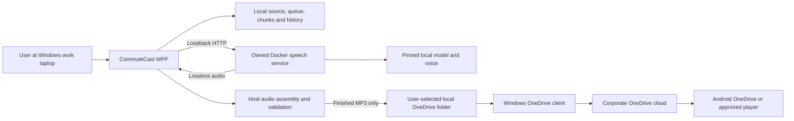
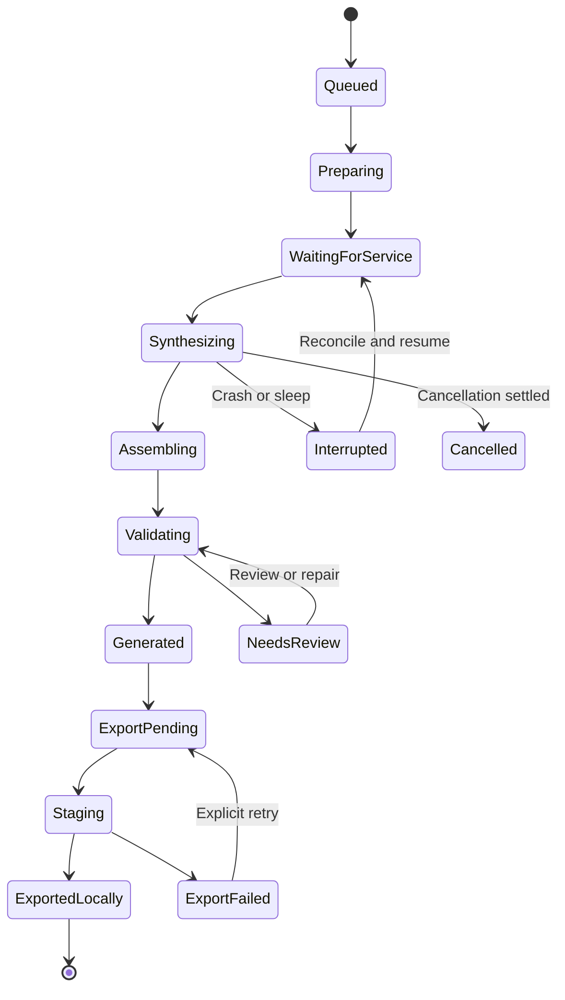

# CommuteCast: Product Requirements, Architecture, and Development Plan

**Document version:** 1.0  
**Prepared:** October 5, 2026 (America/New_York)  
**Status:** Complete planning baseline; implementation and hardware acceptance remain unperformed  
**Product:** CommuteCast  
**Intended deployment:** One user's Windows work laptop, local Docker speech services, and a user-selected corporate OneDrive output folder  
**Deliverable scope:** Documentation only. Examples in this document are design proposals, not implemented interfaces, installation instructions to execute now, or evidence of a working application.

## Contents

1. [Product intent and governing decisions](#product-intent)
2. [Users, context, and journeys](#users-and-journeys)
3. [Scope and priorities](#scope)
4. [Functional requirements](#functional-requirements)
5. [Nonfunctional requirements](#nonfunctional-requirements)
6. [Success measures and feasibility baselines](#success-measures)
7. [Desktop experience and settings](#desktop-experience)
8. [Text preparation, coverage, and pronunciation](#text-preparation)
9. [Engine evaluation and selection](#engine-evaluation)
10. [Architecture and data flow](#architecture)
11. [Provider and audio contracts](#contracts)
12. [Persistence, lifecycle, and recovery journal](#persistence)
13. [Audio assembly and validation](#audio-pipeline)
14. [OneDrive export and phone delivery](#export)
15. [Service readiness and bounded recovery](#service-recovery)
16. [Failure handling matrix](#failure-matrix)
17. [Privacy, deletion, and operational diagnostics](#privacy-and-operations)
18. [Packaging, updates, and licensing](#deployment)
19. [Verification and release acceptance](#verification)
20. [Development milestones and initial backlog](#development-plan)
21. [Requirement traceability](#traceability)
22. [Risk register](#risks)
23. [Decision records and open decisions](#decisions)
24. [Definition of done and handoff](#definition-of-done)
25. [Primary sources and glossary](#sources)

<a id="product-intent"></a>
## 1. Product intent and governing decisions

CommuteCast turns substantial pasted LLM output into a complete, listenable MP3 for a driving commute. The user already saves material with a low-friction paste experience in Karakeep and wants a similarly simple way to turn work text into audio. Karakeep is a capture-experience reference; no Karakeep integration is required.

The product's central promise is **faithful, ordered narration with visible preparation choices and dependable delivery of one finished file**. An attractive interface or fast engine cannot compensate for missing paragraphs, duplicated chunks, mangled numbers, or a file that was never available on the phone. Pleasantness, pacing, and technical intelligibility require direct listening by the user.

The settled architecture is a rich native **WPF desktop utility** on the Windows work laptop. Local speech inference runs in Docker containers on that same laptop. The desktop application prepares text, maintains a durable queue, coordinates speech services, assembles and validates audio, and publishes the completed MP3 into a known corporate OneDrive folder selected during setup. The Windows OneDrive client handles synchronization. The Android phone uses OneDrive or a suitable player to access the uploaded file. After upload, playback must be demonstrated with the laptop switched off.

The earlier home-server web application accessed through Tailscale was explicitly superseded. It has no role in this baseline. A local HTTP API between WPF and a container is an internal inference interface, not a remotely hosted user-facing web application.

### 1.1 Decision hierarchy

| Category | Baseline | Meaning for implementation |
| --- | --- | --- |
| Confirmed product decisions | CommuteCast name; WPF on work laptop; Docker local TTS; corporate OneDrive delivery; one MP3 per submission | Implement as requirements; do not reopen without a reason and a recorded product decision. |
| Recommended architectural defaults | .NET 10 LTS, MVVM, local SQLite, serial generation, PCM/WAV intermediates, host FFmpeg, deterministic titles and preparation | Proposed choices to validate through the milestones, not claims that software already exists. |
| Open technical decisions | Engine, voice, image digest, hardware limits, precise provider API contract, encoder settings, pause rules, installer | Resolve through targeted evidence and record an ADR before freezing the release configuration. |
| External prerequisites | Corporate Docker entitlement and policy; suitable Windows/WSL environment; approved OneDrive destination and Android access | Verify with the actual environment; no tenant, path, hardware, or approval is assumed. |
| Deferred product decisions | Progress tracking, listened status, cross-device resume, Graph verification, model-generated titles | Optional later work; do not add them to MVP acceptance. |

As of this document's source review, .NET 10 is the current LTS release, supported through November 14, 2028. Use `net10.0-windows` and a supported serviced patch when implementation begins. Recheck servicing and OS support before release rather than freezing this document's observed patch as a permanent requirement. [.NET support policy](https://dotnet.microsoft.com/en-us/platform/support/policy/dotnet-core).

### 1.2 Product invariants

1. Preserve the submitted source, freeze the narration settings, and account for every source span. Changes to spoken content must be deterministic and inspectable; omissions require an explicit choice.
2. Generate automatically after a deliberate submission. Editing keystrokes never initiate synthesis. The user never has to submit individual chunks.
3. Produce one final MP3 per job. Incomplete audio must never appear under the final published filename.
4. Generate and validate outside OneDrive. Source, SQLite, WAL files, chunk audio, scratch files, and diagnostics remain local by default.
5. Separate generation success, local export success, and actual cloud/phone availability. A local file write provides evidence only for local export.
6. Recovery is bounded and acts only on verified CommuteCast-owned services. Jobs and validated chunks survive interruption.
7. Do not claim automatic checks prove exact spoken fidelity. Source coverage, decodability, duration, and ASR each provide limited evidence.
8. The laptop must be awake and the app running for generation; once upload is complete, the final file must support the verified phone playback workflow independently of the laptop.

<a id="users-and-journeys"></a>
## 2. Users, context, and journeys

### 2.1 Primary user and operating context

The primary user is a knowledge worker who receives long LLM responses at work, including explanations, plans, comparisons, and technical material. They want to listen during a commute without reconstructing the response, operating infrastructure, or managing dozens of audio fragments. Their work laptop and corporate OneDrive account are the capture and delivery environment. Their Android device is the listening environment.

The same person may perform initial setup and choose a voice. A developer or support role can help with Docker and diagnostics, and corporate IT may own deployment policy and account restrictions. These are operational roles, not separate application accounts. The MVP relies on the signed-in Windows user and the existing OneDrive client; it needs no multi-user authentication system.

Content may contain confidential work information. Local TTS avoids sending text to a cloud speech provider, but the final spoken information is deliberately exported into corporate OneDrive. Corporate account access on Android, permitted external players, downloads, retention, and data loss prevention rules are unknown until tested.

### 2.2 Core journeys

| Journey | Trigger and flow | Successful outcome | Failure behavior |
| --- | --- | --- | --- |
| J-01: First setup | Launch; choose local corporate synced folder; inspect prerequisite results; audition voices; save engine/voice/pacing defaults | Valid local destination and usable speech configuration are remembered; no per-job setup is needed | Show exact missing prerequisite or policy restriction; preserve draft; do not install or elevate automatically. |
| J-02: Paste and queue | Focus editor; paste full response; accept or edit deterministic title; optionally inspect preparation; invoke Queue | Durable job appears immediately; automatic generation begins when ready; editor is available for next input | Invalid/oversized input is retained with actionable explanation; failed persistence must not clear editor. |
| J-03: Long narration | Job prepares, splits, synthesizes, assembles, validates, then exports | Exactly one MP3 contains all approved narration in order with consistent voice and pacing | Stop at failed chunk; retain validated chunks; offer retry; never publish a shortened "complete" file. |
| J-04: Listen on phone | Check OneDrive client/upload externally; open file on Android; select suitable player; prepare before driving | Full audio plays with laptop off after confirmed upload; offline route is documented if verified | App describes local export only; phone/account/player limitations become explicit pilot findings. |
| J-05: Interrupt and resume | Sleep, app exit, crash, or Docker interruption during work | On relaunch/wake, reconciliation finds valid chunks and resumes pending work safely | Partial chunks are rejected; exhausted recovery waits for user retry; no duplicate publication. |
| J-06: Correct and regenerate | Inspect questionable wording/pronunciation; change source or settings; submit a revised job | New immutable job uses changed configuration; earlier history remains distinguishable | No mixed voices or settings inside an existing job; previous output is not overwritten implicitly. |
| J-07: Remove content | Select item or Delete all; choose local-data scope and optional managed-export scope; confirm counts | Workers stop before deletion; selected owned files are removed or failures reported | Never delete unrelated folder contents; cloud recycle bins, retention, and phone copies are not described as erased. |

All phone preparation and testing take place while stationary. Driving playback is the consumption context, not a reason to design an interactive mobile capture flow.

<a id="scope"></a>
## 3. Scope and priorities

**P0 / Must** means required for a releasable MVP. **P1 / Should** means useful polish or supportability that follows the core pipeline; defer only through an explicit release decision. **P2 / Later** means outside MVP acceptance. For P0 items, declining feasibility changes the release decision rather than quietly lowering fidelity.

### 3.1 MVP scope

Native WPF editor and queue; deterministic editable title; submission timestamp; engine and voice selection; short audition; remembered output folder; visible preparation and source accounting; automatic sequential chunk generation; one final MP3; informative progress; cancellation and retry; local preview and open-folder actions; durable history; safe item/all deletion; bounded readiness recovery; local validation; recoverable export; privacy-conscious diagnostics; Windows/container/Android pilot acceptance.

Both Kokoro and Piper are evaluation candidates. The first release may ship one production provider if it satisfies all P0 requirements and the user approves its voice. The engine selector lists installed, tested providers and explains unavailable ones. A second production provider is P1, not a requirement to maintain two simultaneous inference stacks. Audition both candidates before making the choice.

### 3.2 Explicit exclusions and later scope

| Excluded from MVP | Optional future direction |
| --- | --- |
| Home-server deployment, public server, Tailscale, hosted capture UI, mobile app | Reconsider only after a new product decision; do not leave infrastructure hooks driving the current design. |
| Cloud TTS, automatic summarization or LLM rewriting | Explicit opt-in enhancement with separate privacy and fidelity requirements. |
| Podcast feed and subscriptions | Add only if actual phone playback friction warrants it. |
| Listened/unlistened status, bookmarks, cross-device resume, synchronized playback position | Assess chosen player's native capability before creating app-owned synchronization. |
| Microsoft Graph authentication, polling, or cloud upload verification | Separate integration that may add verified upload state later. |
| Generative title model | Local heading/first meaningful sentence and user edit are sufficient initially. |
| Continuous clipboard monitoring, synthesis on edit, voice cloning | Separate deliberate requirements if requested later. |
| Multi-user accounts, teams, sharing, analytics backend | Single Windows-user deployment remains the baseline. |

<a id="functional-requirements"></a>
## 4. Functional requirements

The acceptance criteria below describe required behavior, not completed tests. Test IDs and implementation phases are mapped in [Section 21](#traceability).

### 4.1 Capture, preparation, and voice

| ID | Priority | Requirement | Acceptance criterion |
| --- | --- | --- | --- |
| FR-01 | P0 | Large editable input surface | Paste the approved maximum input without silent truncation; show character count, validation, and a retained draft after submission failure. |
| FR-02 | P0 | Deliberate durable submission | Queue action saves source, script/settings snapshot, and job identity before acknowledging; starts generation automatically; repeated clicks for the same action do not create duplicates. |
| FR-03 | P0 | Editable content-based title | Prefer first heading, otherwise first meaningful sentence, otherwise `CommuteCast` plus timestamp; title editable before queue; no generative model required. |
| FR-04 | P0 | Creation timestamp and identity | Save UTC submission time and display local time with offset; filename includes collision-resistant job identity; retry preserves original creation time. |
| FR-05 | P0 | Traceable narration preparation | Store raw source and narration script with versioned transformation map; account for all spans as spoken, formatting, or explicit exclusion; show changed/excluded portions. |
| FR-06 | P0 | Faithful default content policy | No summarization, rewriting, or silent skipping; code, tables, links, and markup use documented deterministic rules with inspectable script and explicit omission controls. |
| FR-07 | P0 | Engine, voice, and pacing selection | Select supported installed engine/voice; audition a short sample; snapshot voice, model, language, pacing, and pronunciation choices per job. |
| FR-08 | P1 | Pronunciation profile | Versioned user dictionary and number/acronym options preview exactly affected script; unsupported engine controls are disabled with explanation. |

### 4.2 Queue, synthesis, and audio

| ID | Priority | Requirement | Acceptance criterion |
| --- | --- | --- | --- |
| FR-09 | P0 | Persistent queue and history | Ordered jobs and outcomes survive relaunch; unfinished jobs reconcile before dispatch; history shows title, submitted time, stage, duration, and file availability. |
| FR-10 | P0 | Informative progress | Show preparing, service loading, chunk count, assembling, validating, and exporting; use real counters; distinguish waiting from failure; avoid fictitious ETA. |
| FR-11 | P0 | Automatic long-text chunking | Use provider-safe paragraph/sentence boundaries; every script span belongs to exactly one ordered chunk; oversized sentences have a visible deterministic fallback. |
| FR-12 | P0 | Consistent settings and cache validity | All chunks use one immutable synthesis fingerprint; reuse only checksum-validated compatible chunks; changed model/settings invalidate affected cache. |
| FR-13 | P0 | Single complete MP3 | Final assembly includes each validated chunk once in order; encode final MP3 once from lossless intermediates; no partial job is marked complete. |
| FR-14 | P0 | Audio validation | Validate every chunk and final file for decode, format, sample count/duration, channel layout, and anomalies; defects block export or create an explicit review state. |
| FR-15 | P0 | Cancellation | Queued cancellation prevents dispatch; running cancellation stops further work and publishing; safe validated chunks may remain for explicit retry; no false cancel success after committed export. |
| FR-16 | P0 | Retry and resume | Retry resumes at the first invalid/missing stage or chunk; preserves completed compatible work; export-only retry does not regenerate valid audio. |
| FR-17 | P0 | Completed-file actions | Play/stop local preview, open owned MP3, and open folder; missing/moved external file shows an accurate state without erasing job history. |
| FR-18 | P1 | Queue control | Pause future dispatch and resume it; reorder only pending jobs; queued jobs retain captured settings and destination despite later default changes. |

### 4.3 Export, local services, and data management

| ID | Priority | Requirement | Acceptance criterion |
| --- | --- | --- | --- |
| FR-19 | P0 | Remembered user-selected destination | User chooses corporate local synced folder; test write permission; remember path; never invent tenant or folder; revalidate at export. |
| FR-20 | P0 | Recoverable completed-file publication | Validate outside OneDrive; copy finished MP3 to unique destination-volume temporary name; verify bytes/hash; rename without overwrite; journal each stage. |
| FR-21 | P0 | Collision-safe naming and metadata | Sanitize Windows filename; use timestamp/title/short ID; embed title, creation time, and app/job identity; duplicate titles never overwrite output. |
| FR-22 | P0 | Honest delivery states | Display Generated, Exported locally, and Cloud upload unknown distinctly; MVP never infers verified upload or phone readiness from a local write. |
| FR-23 | P0 | Retryable export failures | Disk full, absent folder, denied access, and file locks retain completed local MP3; user can repair/retry or explicitly select replacement destination. |
| FR-24 | P0 | Readiness and prerequisite diagnosis | Distinguish missing prerequisites, stopped Desktop/daemon, stopped/missing owned container, loading model, unhealthy API, wrong service/version, conflict, and resource exhaustion. |
| FR-25 | P0 | Bounded owned-service recovery | Launch already installed Docker Desktop and start verified configured CommuteCast services within fixed attempt/time limits; do not install, elevate, update images, or touch unrelated containers. |
| FR-26 | P0 | Warm-up and restart guard | Wait during bounded loading; one recovery coordinator; never restart a loading model or service with active owned inference until cancellation/quiescence is established. |
| FR-27 | P0 | Crash and sleep recovery | Reconcile source, script, chunk files, leases, and export journal after process loss or wake; resume only validated artifacts; no missing or duplicate final chunks. |
| FR-28 | P0 | Safe app exit | Explain that closing stops in-app generation; checkpoint/cancel within bounded grace period; retain queued jobs; relaunch resumes according to remembered policy. |
| FR-29 | P0 | Delete one item | Offer local source/history/audio removal separately from managed exported MP3 removal; stop active job before removal; report each failure and external-retention limits. |
| FR-30 | P0 | Delete all managed items | Preview item counts and scopes; cancel workers; remove only tracked owned artifacts; preserve unrelated destination files and service model volumes unless separately selected. |
| FR-31 | P1 | Local retention controls | Display usage; clean unreferenced scratch/cache by age/quota; never delete queued source, in-use chunks, or exports through implicit local cleanup. |
| FR-32 | P0 | Actionable status and errors | Normal flow shows service status succinctly; errors state failed stage, preserved work, bounded recovery result, and next action without requiring CLI knowledge. |
| FR-33 | P1 | Redacted diagnostic package | User-triggered export contains versions, state transitions, failure categories and timings; excludes source/script/audio/title/full corporate path by default. |
| FR-34 | P0 | Local inference data boundary | Synthesis request targets verified loopback provider; no cloud text/title inference; no clipboard ingestion without user paste action. |
| FR-35 | P0 | Android delivery pilot | Representative finished MP3 is verified uploaded, accessible, and playable in the actual corporate Android setup with laptop off; document chosen playback route and restrictions. |
| FR-36 | P1 | Version and installation information | About/settings exposes app, provider/model fingerprint, encoder build, and notices; prerequisite diagnostics remain usable when service is unavailable. |

<a id="nonfunctional-requirements"></a>
## 5. Nonfunctional requirements

| ID | Priority | Requirement | Acceptance criterion |
| --- | --- | --- | --- |
| NFR-01 | P0 | Content integrity | No unaccounted substantive source spans; no missing/duplicate/reordered chunks in automated corpus; user accepts observed pronunciation and narration limitations. |
| NFR-02 | P0 | Listening quality | User approves voice, pace, technical intelligibility, volume, and joins using actual representative text; no blanket model-fidelity guarantee. |
| NFR-03 | P0 | UI responsiveness | No synchronous HTTP/process/encoding work on UI thread; meet benchmarked editor and command response targets under generation load. |
| NFR-04 | P0 | Durable recovery | Fault injection at stage boundaries yields recoverable queue and artifacts; safe export reconciliation prevents duplicate committed files. |
| NFR-05 | P0 | Resource feasibility | CPU baseline meets agreed wall-time, memory, disk, and work-laptop responsiveness limits; limit one active synthesis until measurements justify more. |
| NFR-06 | P0 | Bounded failure behavior | Every provider/process wait has cancellation/deadline; documented limits terminate recovery; nontransient failures require explicit repair. |
| NFR-07 | P0 | Privacy and separation | Database, sources, scratch, and logs reside outside OneDrive; final audio upload is deliberate; diagnostics redact content and identifying paths. |
| NFR-08 | P0 | Least-scope service control | Local Docker context, owned project/labels/config identity, loopback API and permitted image digest are verified before mutation. |
| NFR-09 | P0 | Filesystem/process safety | Typed process arguments, canonical path containment, collision avoidance, output ownership, and deletion guards withstand adversarial title/path/input tests. |
| NFR-10 | P0 | Maintainable boundaries | Domain logic does not depend on WPF, Docker, or provider JSON; adapter contract tests cover chosen provider and version. |
| NFR-11 | P0 | Accessibility | Keyboard-only core journey, visible focus, screen-reader labels/status, high contrast, and supported DPI layout pass manual Windows checks. |
| NFR-12 | P0 | Honest observability | Status reflects recorded stages and counters; cloud state remains unknown without separate evidence; logs are useful without source disclosure. |
| NFR-13 | P0 | Supported and reproducible deployment | Supported Windows/.NET baseline; pinned tested provider image/model and encoder; fresh install and rollback exercised; licensing inventory complete. |
| NFR-14 | P0 | Testable operations | Automated and manual acceptance have separate evidence; build/unit success cannot substitute for actual Docker/Windows/Android pilot. |
| NFR-15 | P1 | Storage sustainability | Quotas and retention prevent unlimited growth; cleanup is interruptible and respects leases/tombstones; usage accounting matches managed files. |
| NFR-16 | P0 | Offline generation after setup | With approved image/models already provisioned, normal synthesis has no internet requirement; disconnected export remains local with cloud state unknown. |

<a id="success-measures"></a>
## 6. Success measures and feasibility baselines

There is no measured laptop baseline, chosen voice, verified installation, or accepted throughput target. The following values are **proposed engineering experiment targets**, not product performance claims. M1 replaces them with measured results and agreed release thresholds. Fidelity, one-file completeness, honest status, and bounded recovery remain required regardless of speed.

| Measure | Proposed starting target | Measurement and decision |
| --- | --- | --- |
| Routine capture friction | Paste plus one Queue action when defaults are configured | Observe five realistic submissions; count required interactions and unnecessary interruptions. Complex-content review is available without forcing a wizard for ordinary prose. |
| Input capacity | Aim to support 100,000 Unicode scalar values per submission; test smaller and larger inputs | Agree how UI counts characters; benchmark memory, editor latency, preparation, and synthesis. Warn/reject above a measured cap without truncation; never split into multiple exported MP3s implicitly. |
| Benchmark corpus | 12 distinct texts: 4 prose, 4 technical/structured, 2 long, 2 adversarial | Include actual representative work text locally; use synthetic or redacted equivalents for repository tests. Include 10k, 50k, and 100k-scalar sizes where practical. |
| Content accounting | 100% classified source spans and exactly-once ordered script coverage | Automated invariants on approved preparation corpus; distinguish formatting classification from substantive narration coverage. |
| Manual spoken fidelity | Zero known substantive omissions, duplicated passages, or materially wrong technical facts in the release audition corpus | Listener compares full short samples and complete selected long samples; remaining pronunciation limitations documented and approved. Sampled checks on other jobs are not a proof of all speech. |
| Voice approval | At least 4/5 for pleasantness and intelligibility by the user, with no fatigue concern in a 20–30 minute sample | Subjective rubric; use consistent text, loudness, headphones and stationary phone/car test. User's judgment overrides model marketing or generic ratings. |
| UI response | Typical Queue/Cancel feedback within 250 ms; 100k paste/editor usable within 2 s | Instrument dispatcher stalls under active synthesis. These figures are experiment goals, not known performance. |
| CPU inference feasibility | Initial warm real-time factor (RTF) target at or below 1.0; stretch target at or below 0.5 | RTF = synthesis wall time / generated audio duration. Record cold-start, preparation, assembly, export separately. Establish an end-to-end target for the actual pre-commute window. |
| Resource caps | Begin experiments with one synthesis worker, up to 4 effective CPU cores and 4 GiB service memory where available | These caps may be unsuitable for the unknown laptop. Record Windows RAM, WSL allocation, peak working sets, work-app responsiveness and thermal behavior; adjust and agree before release. |
| Storage headroom | Experiment with 2 GiB free-space floor plus job-specific estimate | Lossless speech can dominate disk use. Estimate from duration and sample format, with headroom for staging and final copy; do not treat fixed free space as universally sufficient. |
| Recovery | Initial model warm-up budget 5 min; no more than 2 owned-service starts and 1 controlled restart per recovery episode | Tune after cold-start tests. Explain exhaustion; no endless loop. An episode spans all jobs affected by the same outage, not a new allowance per job. |
| Reliability pilot | 20 end-to-end jobs over 5 workdays with zero silent incomplete exports | Include planned interruption and retry; record all failures and recovery. This small pilot is an exit gate, not a statistical uptime claim. |
| Phone independence | Uploaded files play with laptop off in the actual approved Android route | Verify full seek/play behavior. Offline playback and resume are separate observed capabilities; failure of resume alone does not fail MVP. |

Target hardware is the user's actual Windows work laptop. CPU model, architecture, RAM, available disk, Windows build, WSL/Docker versions, power policy, endpoint protection, and optional GPU remain open. Do not substitute a developer workstation benchmark for laptop acceptance. Record AC and battery conditions; CPU-first means the baseline does not require a GPU. If neither candidate meets quality and practical generation time, report the evidence and revise the product decision before implementation proceeds.

Metrics remain local. No remote usage telemetry or analytics service is required. Development measurements should use job IDs and aggregate counts rather than retaining sensitive benchmark text in shared records.

<a id="desktop-experience"></a>
## 7. Desktop experience and settings

### 7.1 Main window proposal

```text
+--------------------------------------------------------------------------------+
| CommuteCast                                   Speech: Ready        Settings     |
+------------------------------------------------------+-------------------------+
| New narration                                        | Queue and history       |
| Title [editable content-based suggestion           ] |                         |
| Engine [tested provider] Voice [chosen voice]         | > Design options        |
| Pace [1.0x]  [Audition]                               |   Generating 8 / 24     |
|                                                      |   [Cancel]              |
| +--------------------------------------------------+ |                         |
| | Paste or type the full response here.             | | > Weekly summary        |
| | Large text editor; ordinary paste/undo/search.     | |   Queued                |
| |                                                  | |                         |
| +--------------------------------------------------+ | > Migration notes       |
| 42,680 characters  [Review narration preparation]     |   Exported locally      |
| Content policy: Faithful  [Details]                   |   Cloud upload unknown  |
|                                                      |   [Play] [Open folder]  |
| [Queue narration]   [Clear draft]                     |   [Retry] [Delete]      |
+------------------------------------------------------+-------------------------+
| Output: chosen folder   [Open]     Pending 2    [Pause queue]    Storage usage    |
+--------------------------------------------------------------------------------+
```

This is a wireframe, not an implemented screen. At smaller widths the queue moves beneath the editor; minimum sizing and DPI behavior are validated on Windows. The primary action is always Queue narration. Service details expand only on a problem or explicit diagnostics action.

The editor should use a plain-text representation even when pasted content contains Markdown. Preserve raw Unicode and line breaks in the source snapshot. Rich editing is not needed to achieve a rich desktop experience. Avoid a control choice that makes large inputs unresponsive; evaluate WPF TextBox versus an appropriate large-text editor dependency during M2.

### 7.2 Interaction rules

- Suggested shortcuts: `Ctrl+Enter` queues, `Ctrl+N` starts a new draft, `Ctrl+F` finds text, and standard `Ctrl+V`, undo, redo, select-all operate normally. Validate shortcut conflicts and screen-reader behavior.
- On successful durable submission, show the job in the queue, clear the submitted draft, and return focus to a fresh editor. On failure, retain input and title. Guard accidental double-submission through a command token and disabled in-flight submit command.
- Queue rows use text and icons as well as color. Show stage and actual completed/total chunk count. Model loading is indeterminate progress with elapsed time and an upper budget.
- Audition uses a short local sample and current settings, has Play/Stop, never exports to OneDrive, and shares the provider scheduler so it cannot restart or disrupt an active job. Offer a fixed audition text and a short user-selected excerpt.
- Job details show immutable source/script snapshots, preparation summary, selected voice/model, created time, duration, warnings, retries, and export state. Do not expose chunk-management controls in the routine journey.
- New jobs snapshot current defaults. Default edits do not mutate queued/running jobs. Narration changes require a new revision/job; metadata-only title edits before export may be supported under a controlled lock without resynthesis.
- For MVP, post-export title changes should create a deliberate retagged/re-exported version or remain a history-only label with clear wording. Do not silently rename an uploaded file the phone may already be using.
- A cancellation request may initially show Cancelling. If final publication already committed, report Exported locally and offer deletion rather than falsely claiming the export never happened.
- No automatic duration estimate until a calibrated engine/voice model exists. If later added, display a range and label it estimated; progress percentages must not imply unknown chunk lengths are equal work.

### 7.3 Settings proposal

| Area | User-visible choices | Persistence and guardrails |
| --- | --- | --- |
| Output | Browse for corporate local synced folder; test write; open folder | Persist absolute selected path locally; do not infer corporate tenant from environment variables. Destination changes affect future jobs unless explicitly applied to an export retry. |
| Speech | Tested engine, voice, language, pacing; audition | Only supported capabilities appear; record full version/model fingerprint; engine-dependent speed conversions need contract tests. |
| Content | Faithful profile; visible code/table/link policies; pronunciation dictionary | Version and snapshot profiles; omissions never enabled by surprise; list exclusions before submission. |
| Queue | Resume pending jobs on launch; pause dispatch | Proposed default: resume after reconciliation when prerequisites are healthy, except cancelled/deleted/review-blocked jobs. |
| Services | Bounded automatic start enabled; advanced status/version/config | Proposed default: enabled for installed, preconfigured owned services; no auto-install/update/elevation. Explicit Stop service is advanced and requires no active inference. |
| Storage | Local usage, cleanup/retention, delete local data, delete managed exports | Default retain sources/history until user deletes; reclaim successful-job scratch after a proposed 7-day retry window; tune quota through M1. |
| Diagnostics | Redacted local logs; export support bundle; notices/about | No source capture by default. Content-inclusive troubleshooting requires deliberate local choice and is never sent automatically. |

Accessibility acceptance includes keyboard-only setup/paste/queue/cancel/retry/delete, proper labels and focus restoration, Narrator reading status and errors without repeated noise, high contrast, and layouts at 100%, 150%, and 200% DPI. Deletion dialogs must communicate selected scope and counts clearly.

<a id="text-preparation"></a>
## 8. Text preparation, coverage, and pronunciation

### 8.1 Three separate artifacts

**Raw source** is the exact submitted text, stored locally and immutable for the job. **Narration script** is the deterministic, approved spoken representation with pause/structural annotations. **Coverage map** records the relationship between the two, including formatting removal, expansions, insertions and explicit exclusions. Engine-specific requests are derived from the script without losing the map.

A source span can be classified as: spoken unchanged; spoken through a named deterministic transform; formatting-only; or excluded by an explicit user policy. Synthetic structural cues such as "row two" have no source span and are marked as inserted. Classification must not let substantive content disappear under a generic formatting label. An explicit exclusion report lists scope and reason.

Use one documented offset convention internally, recommended Unicode scalar offsets into the preserved source with a mapping to WPF's UTF-16 editor indices. Test surrogate pairs, combining characters, CRLF/LF, and emoji. A separate script span map links narration text to ordered chunks. Whitespace may be normalized for speech, but raw source bytes/text and transformation version remain available.

### 8.2 Default and optional handling

| Input type | Faithful default proposal | Explicit alternatives and visible effects |
| --- | --- | --- |
| Prose and paragraphs | Preserve words and order; normalize whitespace deterministically; mark paragraph pauses | User-adjustable pacing/pauses; no paraphrase or compression. |
| Headings | Speak heading text and add a calibrated pause | Optional "heading" cue; stripping `#` is recorded as markup removal. |
| Bullets and numbered lists | Speak every item in order; retain meaningful numbering; short item breaks | Optional "item" cue. Never merge away qualifications or nested items. |
| Inline emphasis and Markdown | Speak text while classifying paired emphasis markers as formatting | Literal-markup mode for technical discussion; unmatched/ambiguous syntax preserved or flagged rather than erased. |
| Code fences and inline code | Announce code boundary; verbalize each nonblank line with deterministic symbol/identifier handling; show expanded script | Optional literal character spelling or explicit block exclusion. No automatic explanation or execution of code. Warn that long code narration may be tiring. |
| Tables | Deterministically read headers and every cell in row order, using column labels; represent empty cells explicitly | Literal row reading or explicit table exclusion. Ragged/ambiguous tables are flagged; no guessed relationships or summary. |
| Markdown links | Speak label and the visible target using deterministic URL pronunciation; classify delimiters as formatting | Label-only or domain-only requires explicit choice and reports omitted target components. Do not fetch the link. |
| Bare URLs, paths, hashes | Preserve by verbalizing characters/separators as needed; preview can be long | Explicit shortening/exclusion with precise coverage report; no hidden dereferencing. |
| Numbers, dates, units, versions | Preserve meaning and use tested deterministic rules; ambiguous forms retain a conservative spoken representation | User-selected locale/date interpretation; scientific/version/digit modes. Changes are mapped, not guessed from a model. |
| Acronyms and technical terms | Conservative engine pronunciation plus explicit versioned user overrides | Spell-letter mode or dictionary entry; avoid blanket expansion of acronyms with unknown meanings. |
| HTML/XML and structured data | Treat as text/markup with safe deterministic parsing; preserve substantive values and attributes | Approved literal or structured reading profiles; never execute embedded content or load remote assets. |
| Unsupported language, malformed markup, invisible controls | Preserve source; expose detection/warnings and safe escaped preview | Block unsupported synthesis where necessary; a successful queue must not imply adequate pronunciation in an unsupported language. |

Faithful does not mean every formatting glyph must be uttered in ordinary prose. It means all substantive material is accounted for and transformations are inspectable. Conversely, a code operator, negative sign, URL target, or table cell is substantive; classifying it as decorative markup is unacceptable. For complex content, show the prepared script and warnings before queueing, while keeping the default prose path one action.

Proposed example:

```text
Source:
## Result
- API latency fell from 1.25 s to 850 ms.
- Version 2.10 keeps the flag `--dry-run`.

Prepared script, subject to selected pronunciation rules:
Result.
[paragraph pause]
API latency fell from one point two five seconds to eight hundred fifty milliseconds.
[item pause]
Version two dot ten keeps the flag dash dash dry dash run.
```

The user may choose to pronounce API as letters. `2.10` must not become "two point one" when it denotes a version. The coverage map records each expansion and marker removal. This sample demonstrates a rule set, not an assurance that either candidate engine will realize every word correctly.

### 8.3 Chunking and settings

Prepare the complete script first. Use paragraph boundaries preferentially, then provider-aware sentence boundaries, then safe clause/whitespace boundaries for oversized sentences. Avoid breaking Unicode scalar sequences, acronyms, decimal numbers, URLs, or pronunciation replacement units. If an unbroken token exceeds the provider limit, either apply a visible literal-spelling strategy or fail with a specific preparation error; do not truncate.

Initial experimental chunk size: about 300–800 characters of spoken prose, bounded by the pinned provider's measured token/phoneme/request limits. Character length is only a planning aid. Provider internal splitting, number expansion, and non-English tokenization can change effective limits. M1 determines an actual safe maximum and hard rejection behavior using boundary cases.

Each manifest entry contains a contiguous script range, ordinal, content hash, settings fingerprint, expected boundary pause, and generated artifact record. Concatenated ranges must reproduce the script exactly, except explicit pause annotations handled separately. A coverage failure blocks synthesis or assembly. All chunks use the same voice/model/language/pacing; no silent fallback to another engine mid-job.

### 8.4 Provider normalization is also a fidelity boundary

Deterministic host preparation does not guarantee a provider preserves the submitted script. Pin and examine provider-side normalization, internal chunking, length caps, special markup, and logging. Disable provider interpretation of voice tags/SSML/control markers unless intentionally generated by the host and part of the verified contract. Treat pasted text as data, including strings that resemble engine controls.

The observed Kokoro-FastAPI v0.9.0 release includes normalization changes. Evaluate that release as a candidate, especially technical numbers/acronyms and paragraph boundaries; do not select it solely because it is current. Capture its exact image digest and normalization configuration only after successful acceptance. [Kokoro-FastAPI release notes](https://github.com/remsky/Kokoro-FastAPI/releases).

<a id="engine-evaluation"></a>
## 9. Engine evaluation and selection

### 9.1 Source-backed candidate comparison

| Candidate | Verified upstream facts | CommuteCast evaluation needs |
| --- | --- | --- |
| Kokoro | Upstream code is Apache-2.0; the repository documents Windows installation of its phonemizer dependency. This does not establish Docker operation on this laptop. [Kokoro upstream](https://github.com/hexgrad/kokoro). | User voice audition; CPU warm/cold benchmarks; technical pronunciation; request limits; lossless output and normalization control. |
| Kokoro-82M weights | The model card declares Apache-2.0 weights. It is separate evidence from the code license. [Kokoro model card](https://huggingface.co/hexgrad/Kokoro-82M). | Pin model and selected voice artifact hashes; review component inventory and notices. Do not infer subjective quality or local speed from upstream claims. |
| Kokoro-FastAPI | A community wrapper maintained in `remsky/Kokoro-FastAPI`, not the official Kokoro upstream. It offers CPU/GPU Docker images and an OpenAI-compatible speech API; wrapper code declares Apache-2.0. [Community wrapper](https://github.com/remsky/Kokoro-FastAPI). | Evaluate a minimal CPU deployment without its optional WebUI/features; verify pinned API, ready/health semantics, raw/WAV support, input interpretation, log redaction, cancellation, and image provenance. |
| Current Piper | `OHF-Voice/piper1-gpl` declares GPL-3.0 and includes a Dockerfile. [Piper upstream](https://github.com/OHF-Voice/piper1-gpl), [Piper Dockerfile](https://github.com/OHF-Voice/piper1-gpl/blob/main/Dockerfile). | Build/provision a pinned CPU image; verify HTTP integration, identity/readiness contract, cancellation and response format. Do not infer old Piper licensing applies to this current project. |
| Piper voices | Each selected voice's model card contains licensing information; restrictions vary. [Piper voice documentation](https://github.com/OHF-Voice/piper1-gpl/blob/main/docs/VOICES.md). | Choose specific voices only after listening and model-card review; pin `.onnx` and configuration hashes and record obligations. |

Neither candidate is selected. No speed ranking or compatibility claim has been established for the target laptop. The architecture permits swapping a provider without replacing queue, preparation, persistence, or export logic.

### 9.2 Audition and benchmark protocol

1. Inventory the actual laptop and approved prerequisite configuration; note power mode and relevant work applications. Verify corporate provisioning/download rules before acquiring engine artifacts during implementation.
2. Build a local representative text corpus with the user: technical terms, acronyms, dates, negatives, decimals, currency, units, code operators, tables, URLs, headings, lists, paragraph transitions, very long sentences, Unicode, and long narrative sections.
3. Audition at least three licensed suitable English voices per candidate if available. English is the proposed initial language; confirm actual content needs. Use the same script/settings and loudness for comparison.
4. Produce short 30–60 second samples and at least one 20–30 minute narrative per finalist. Listen on Windows and the eventual stationary Android playback route. Score pleasantness, fatigue, pacing, intelligibility, pronunciation, and joins separately.
5. Benchmark cold Docker startup, model loading, first synthesis, warm throughput, CPU/memory/disk peaks, queue responsiveness, battery/thermal effects, and long-input failure behavior. Run at least three repeats per workload and retain timings/conditions.
6. Test provider boundary limits, malformed requests, unsupported voice, response truncation, disconnect, model absence, lossless output, and normalization behavior. Capture actual requests with synthetic text in local contract evidence.
7. Compare findings against proposed targets. Choose primary engine/voice with user approval; record known weaknesses, accepted controls, license inventory, exact versions/digests, and fallback decision in ADR-04.

Optional ASR round trips can help identify likely anomalies. Keep ASR local if used and mark it experimental; no ASR dependency is required for MVP. It may misrecognize technical words or reproduce the same error as TTS. Human source-to-audio review remains necessary.

<a id="architecture"></a>
## 10. Architecture and data flow

### 10.1 System context



Textual equivalent: the user submits text in WPF. CommuteCast stores local job state, sends prepared chunks to a same-laptop Docker service, retrieves lossless audio, and assembles/validates it with a host audio utility. It publishes only the finished MP3 into the selected OneDrive folder. OneDrive performs cloud upload; the phone obtains the uploaded file. All arrows through cloud/phone are outside the MVP application's upload-status authority.

### 10.2 Application boundaries

WPF supplies Windows-native controls, data binding and layout; it runs on Windows even though modern .NET is cross-platform. That fits the confirmed laptop deployment. [WPF overview](https://learn.microsoft.com/en-us/dotnet/desktop/wpf/overview/).

Recommended solution boundaries, subject to implementation refinement:

| Component | Responsibilities | Must not own |
| --- | --- | --- |
| `CommuteCast.Desktop` | WPF views, MVVM view models, commands, focus, dialogs, dispatcher-safe updates, local preview, composition root | Provider JSON, content segmentation algorithms, SQL transaction policy, Docker CLI parsing. |
| `CommuteCast.Application` | Submit/cancel/retry/delete use cases; queue scheduler; pipeline orchestration; recovery; progress; locks; export coordination | Direct view/control manipulation or provider-specific assumptions. |
| `CommuteCast.Domain` | Job identity/state, immutable settings, source/coverage/chunk manifest, transition rules, ownership/deletion invariants, fingerprints | WPF, HTTP, filesystem side effects, process execution, or SQLite dependency. |
| `CommuteCast.Infrastructure` | SQLite repository, host files, safe process runner, Docker controller, clock/hash services, OneDrive-folder export adapter, diagnostics | UI policy or unrecorded modifications to domain state. |
| `CommuteCast.Speech` | Kokoro/Piper adapters and contract validation; provider capabilities, identity, audio/error translation | Final file naming, OneDrive export, global queue persistence. |
| `CommuteCast.Audio` | PCM normalization, boundary pause assembly, final MP3 encoding, probe/decode validation, metadata | Speech-engine selection or queue command handling. |
| Verification projects | Preparation/state tests; fake provider; adapter integration; fault-injection/export tests; manual acceptance evidence references | Sensitive work text or actual corporate account paths in shared fixtures. |

These are logical boundaries; a small project may combine assemblies while preserving dependency direction. Use .NET dependency injection at the desktop composition root, explicit interfaces for side effects, typed configuration and validation, and a background worker hosted by the application process. MVVM commands invoke application use cases and observe state; do not let view models become the queue coordinator.

### 10.3 Concurrency model

Start with one active job and one provider request at a time. Audition shares the same inference gate, and maintenance uses the same ownership/recovery locks. A durable database determines work eligibility; an in-memory channel can signal new work but is never the authoritative queue.

Use asynchronous HTTP, database I/O where appropriate, process waits and file copies. Run genuinely CPU-bound host work off the UI dispatcher. Marshal view-bound updates to the WPF dispatcher, throttle repetitive progress to a practical rate, and never block on `Task.Result`/`Wait` in UI commands. Microsoft's WPF threading guidance describes dispatcher ownership and the need to keep UI work small. [WPF threading model](https://learn.microsoft.com/en-us/dotnet/desktop/wpf/advanced/threading-model).

The app should be single-instance per Windows user/local data root, enforced with a named mutex and a durable scheduler lease. A second window/process activates the existing app instead of running duplicate workers. Database leases and generation attempt tokens remain useful against stale callbacks after crash/retry.

### 10.4 End-to-end sequence

```mermaid
sequenceDiagram
    participant User
    participant UI as WPF UI
    participant App as Application worker
    participant DB as Local SQLite
    participant TTS as Local speech API
    participant Audio as Host audio utility
    participant Dest as OneDrive local folder
    User->>UI: Paste, review if needed, Queue
    UI->>App: Submit immutable source and settings
    App->>DB: Commit job, script and manifest
    App-->>UI: Accepted job ID
    App->>TTS: Verify identity and readiness
    loop Ordered chunks
        App->>TTS: Synthesize script chunk
        TTS-->>App: Lossless audio
        App->>Audio: Validate and normalize chunk
        App->>DB: Record validated artifact and progress
    end
    App->>Audio: Assemble, encode once, validate MP3
    App->>DB: Record Generated and export intent
    App->>Dest: Stage completed bytes on destination volume
    App->>Dest: Verify and rename to final MP3
    App->>DB: Record ExportedLocally
    App-->>UI: Exported locally; cloud upload unknown
```

Textual fallback: source and settings are durably accepted before generation. Each ordered chunk is synthesized and validated before its record is committed. All validated chunks form one MP3. Export intent is saved before staging bytes; final rename is reconciled with a later database commit. The app then reports local export success. OneDrive upload proceeds independently.

### 10.5 Host versus container responsibility

The host owns source preparation, coverage, chunk boundaries, scheduling, retries, canonical audio format, MP3 assembly, metadata, local persistence, cleanup and publication. Containers own model loading, local inference and the minimal API/readiness contract. They do not write into OneDrive or receive broad access to the user's Documents or work folders.

Prefer HTTP audio responses, with tightly bounded response sizes, over shared per-job file mounts. If a provider requires file outputs, mount a narrowly scoped owned exchange directory and validate returned filenames. Model files can be embedded in an image or stored in an owned model volume. Avoid mounting an empty volume over baked-in models accidentally; the provisioning contract must choose and document one pattern.

Docker bind mounts can modify host files unless configured read-only; Docker Desktop mediates Windows paths through its Linux environment. This supports narrow, read-only model mounts where appropriate and avoiding large host-directory mounts. [Docker bind mounts](https://docs.docker.com/engine/storage/bind-mounts/).

<a id="contracts"></a>
## 11. Provider and audio contracts

### 11.1 Application-facing contract proposal

The following C# sketch is illustrative. It must be refined after M1; it is not a shipped API or a promise that provider endpoints match it.

```csharp
public interface ISpeechProvider
{
    Task<ProviderProbe> ProbeAsync(CancellationToken cancellationToken);
    Task<IReadOnlyList<VoiceDescriptor>> ListVoicesAsync(
        CancellationToken cancellationToken);
    Task<SpeechArtifact> SynthesizeAsync(
        SpeechRequest request, Stream destination,
        CancellationToken cancellationToken);
}

public sealed record SpeechRequest(
    Guid JobId, int ChunkOrdinal, string Script,
    string VoiceId, string Language, double Pace,
    string SynthesisFingerprint, Guid AttemptId);

public sealed record SpeechArtifact(
    string MediaType, int SampleRate, int Channels,
    long SampleFrames, string ProviderFingerprint);
```

`SpeechArtifact` reports adapter-observed metadata; the host independently validates actual bytes. The `AttemptId` fences late callbacks and duplicate responses. A request identifier is not an assumption that a provider offers transactional idempotency. The host achieves exactly-once inclusion/publication while inference may run more than once after a lost response.

`ProviderProbe` should contain availability, identity, API compatibility, loading/ready state, current model/voice fingerprints, capabilities, and a sanitized diagnostic code. If the selected provider lacks a reliable ready endpoint, use a minimal pinned service shim or a validated small synthesis probe under the inference lock. Do not pretend an HTTP 200 from a generic root page proves readiness.

Proposed capability fields: lossless formats, native sample formats, supported voices/languages, effective input limits, pacing range/mapping, normalization controls, cancellation behavior, maximum concurrent requests, and provider identity source. Cache voice lists by fingerprint, not forever across updates.

Piper's current HTTP documentation describes WAV synthesis through `/synthesize`, voice enumeration through `/voices`, and information through `/info`. These are candidates for adapter integration; revalidate against the selected release/image. Kokoro-FastAPI's speech API is a different contract. Normalize both behind the application interface rather than assuming a common endpoint or JSON schema. [Piper HTTP API](https://github.com/OHF-Voice/piper1-gpl/blob/main/docs/API_HTTP.md), [Kokoro-FastAPI API documentation](https://github.com/remsky/Kokoro-FastAPI).

### 11.2 Normalized audio contract

Proposed canonical intermediate: WAV containing signed 16-bit little-endian PCM, one channel, **24,000 Hz**. This is a starting design choice, not a requirement that every provider naturally emits that rate. M1 may choose another single supported rate based on engine output, MP3 support, audition and phone tests. Persist actual native and normalized format for every artifact.

Adapters request lossless PCM/WAV. Provider-native output may vary by voice; normalization explicitly resamples/converts once into the selected contract and never merely relabels a WAV header. Reject mismatched declared/decoded sample format, impossible frame counts, corrupt headers, or compressed audio masquerading as WAV. If a provider emits multiple internal segments, the adapter must return the full intended chunk in correct order or expose a contract failure.

An adapter must not silently return MP3 chunks and let the host decode/re-encode them as the normal path. If a candidate cannot provide satisfactory lossless output, record that limitation and reconsider it at the engine gate. Output limits need to account for long literal code/URL expansions, not just input length.

### 11.3 Provider error translation

| Provider/process symptom | Application category | Retry policy |
| --- | --- | --- |
| Connection refused / daemon unavailable | ServiceUnavailable | Run shared bounded readiness recovery, then retry missing chunk. |
| Model initialization / warm-up | Loading | Backoff within loading budget; no restart while loading. |
| Timeout / connection lost mid-response | TransientSynthesisFailure | Discard partial artifact, fence attempt, reconcile server quiescence and retry within cap. |
| Unsupported voice/language / too-large request | InvalidConfiguration or InputLimit | No blind retry; repair preparation/settings and create new manifest/job as needed. |
| 5xx / corrupt response | ProviderFailure | Limited retry; distinguish deterministic repeatable failure from transient fault. |
| 429 / provider busy | Busy | Backoff; do not restart a working service. |
| API schema/model/version mismatch | IncompatibleProvider | Stop dispatch; show expected/observed fingerprint; no automatic image update. |
| OOM, disk exhaustion, resource failure | ResourceUnavailable | Pause and explain; preserve good artifacts; no restart storm. |
| Request cancellation | Cancelled or CancellationPending | Never treat as a transient retry; do not publish late results. |

Read sanitized error fields and status codes, not unbounded error bodies that may echo source. Set separate connect, readiness, synthesis, and process deadlines. Disable redirects for synthesis or revalidate loopback identity before following any allowed local redirect. HTTP proxy settings must not route prepared source through a corporate proxy accidentally; explicit loopback handling is tested.

<a id="persistence"></a>
## 12. Persistence, lifecycle, and recovery journal

### 12.1 Storage layout proposal

Resolve Windows Known Folders instead of hardcoding a username. Proposed root is `%LOCALAPPDATA%\CommuteCast` on a local nonsynced volume. Validate that custom locations are not a cloud-synced path; discourage placing the database there even if selected manually.

```text
%LOCALAPPDATA%\CommuteCast\
  state\commutecast.db           queue, settings, coverage, journal
  state\commutecast.db-wal       SQLite-owned when WAL enabled
  state\commutecast.db-shm       SQLite-owned when WAL enabled
  jobs\<job-id>\source.txt        immutable submitted source
  jobs\<job-id>\script.txt        approved narration script
  jobs\<job-id>\chunks\           validated WAVs and attempt files
  jobs\<job-id>\final\            validated local MP3
  cache\                         optional content-addressed compatible WAVs
  logs\                          redacted rolling diagnostics
  config\                        pinned owned service manifest
  tools\                         approved encoder/probe utility if bundled

User-selected corporate local OneDrive folder\
  <timestamp> - <safe-title> - <short-job-id>.mp3
```

OneDrive contains the final MP3 and, briefly, its publication staging file as discussed in Section 14. No required synced sidecars. Coverage and manifests stay in the local database, with local file representations only if useful for recovery. Model volumes and Docker image layers are separate managed storage, counted separately in diagnostics.

SQLite is recommended for transactional local queue/history and schema migrations. WAL mode is reasonable for local reader/worker concurrency, with managed checkpoints and a deliberate durability configuration; evaluate `synchronous=FULL` for acknowledgement of queue submission. SQLite documents additional WAL/shared-memory files and limitations on network filesystems. This is another reason the live database stays local. [SQLite WAL documentation](https://sqlite.org/wal.html).

Do not copy an open `.db` alone as a backup. Use a supported consistent backup strategy or close/checkpoint safely; preserve migrations and validate restore during deployment tests. Runtime database/journal files never become repository artifacts.

### 12.2 Proposed logical schema

| Entity | Key fields | Constraints and purpose |
| --- | --- | --- |
| Job | `JobId`, submission token, created UTC/offset, display title, source/script hashes and owned paths, preparation version, state, priority, destination snapshot, settings JSON, synthesis/packaging fingerprints, row version, cancellation/deletion intent | Immutable source and narration settings; unique submission token; safe state transitions; no implicit deduplication of deliberate repeated submissions. |
| SourceCoverage | `JobId`, source start/length, script start/length, classification, transform ID, exclusion reason | Ordered source partition; explicit inserted cues handled with nullable source range; no unexplained substantive omissions. |
| Chunk | `JobId`, ordinal, script range, text hash, synthesis fingerprint, state, attempt token, checksum, owned relative path, native/normalized format, frames/duration, warning flags | Unique `(JobId, ordinal)`; ranges cover script once; artifact counts correspond to manifest. |
| Attempt | ID, job/chunk/stage, started/completed time, monotonic elapsed, retry count, category, sanitized diagnostic, lease token | Distinguish attempts from successful chunks; late results must match current token before promotion. |
| Export | ID, job ID, destination snapshot, temp/final relative name, expected size/hash, state, commit time, cloud state, last error | Unique managed publication identity; persisted intent before external file operations; cloud `Unknown` in MVP. |
| JobEvent / RecoveryJournal | Sequence, job ID, operation ID, state transition or filesystem intent, UTC, outcome | Durable reconciliation evidence, distinct from disposable logs. |
| Settings | Version, output folder, installed provider config, defaults, retention, limits, resume policy | Validate on load; changes affect future jobs; no source text in settings. |
| CacheEntry | Synthesis key, relative path, checksum, frames/format, last-used, references/lease | Optional; successful per-job chunk reuse is sufficient initially; cleanup cannot remove leased/referenced data. |
| DeletionIntent | ID, job/scope, generation fence, artifact list, progress/failures, created time | Prevent resurrection by running workers; recover interrupted Delete all; keep minimal intent until cleanup outcome is known. |

For source/script files, write an owned temporary file, flush/close, rename to immutable owned name, and then commit references. A crash before reference commit produces an orphan eligible for later reconciliation; never acknowledge accepted submission until referenced artifacts and database transaction succeed. A failed submission leaves the editor intact. Hash files at promotion and reconcile before treating them as valid.

### 12.3 Separate generation, export, and cloud states

Generation states: `Queued`, `Preparing`, `WaitingForService`, `Synthesizing`, `Assembling`, `Validating`, `Generated`, `NeedsReview`, `Failed`, `Cancelling`, `Cancelled`, `Interrupted`, `Deleting`, `Deleted`. A UI may simplify these labels while preserving the underlying distinctions.

Export states: `NotRequested`, `Pending`, `Staging`, `StagedValidated`, `Published`, `Failed`, `MissingExternally`, `Deleting`, `Deleted`. Cloud state is `Unknown` in MVP; a future adapter may record `VerifiedUploaded` with evidence/time, never derive it from `Published`.



This diagram shows the common path and selected branches. Textual rule: cancellation/failure/deletion can interrupt any uncommitted stage; work eligibility comes from the persisted state plus intent flags. `ExportedLocally` is a convenient composite UI label for Generated + Published, not a cloud-upload claim. Cancellation after Generated can stop a pending export without discarding the valid MP3.

### 12.4 Fingerprints and cache reuse

Hash canonical serialized fields with a documented algorithm such as SHA-256. The synthesis fingerprint includes provider/adapter contract version, image digest, engine/library version, model and voice hashes, language, pace mapping, pronunciation profile/version, preparation version, relevant provider normalization settings, seed/noise settings if supported, and normalized audio contract version. Combine that with exact chunk script hash for reuse.

Packaging fingerprint separately includes ordered chunk checksums, pause policy, gain/normalization rules, canonical sample format, encoder build/settings, metadata version and title revision. Metadata-only changes should not force synthesis, but re-encoding a lossy final MP3 is not the default; regenerate packaging from retained lossless chunks or retag safely under a verified metadata-only method.

Never assume matching text alone means equivalent audio. Do not reuse a chunk from another model, pace, pronunciation profile, or changed provider normalization configuration. Revalidate file hash/format and lease ownership before reuse. Content hashes are themselves sensitive metadata; do not export a complete searchable corpus of hashes to diagnostics without need.

### 12.5 Idempotency and restart reconciliation

Use at-least-once stage execution with idempotent artifact promotion. Exactly-once final inclusion is achieved by manifest ordinal/checksum validation, not by assuming inference is exactly once. All external operations use persisted intent, deterministic owned identities, and no-overwrite promotion.

On startup or wake:

1. Acquire the application/scheduler lease; validate/migrate database without dispatching.
2. Honor cancellation/deletion tombstones first. Invalidate stale attempt tokens so late responses cannot promote files.
3. Mark stale running stages Interrupted; verify immutable source/script and manifest invariants.
4. Verify completed chunk checksums/format. Delete or quarantine owned partial files; return invalid chunk entries to pending.
5. Reconcile generated MP3 and export journal against actual hashes/paths. A published file created before the database crash is adopted only with matching recorded identity and expected bytes.
6. Check local service identity/readiness and destination as needed; resume the first required stage. Review-blocked, cancelled, incompatible, or deleted jobs do not auto-resume.
7. Clean old unreferenced artifacts only after leases and active export/deletion records are accounted for.

Do not blindly restart every interrupted chunk: a disconnected HTTP request may still be generating in the container. The selected provider's cancellation/busy behavior must be tested. The coordinator waits for quiescence under a bounded deadline, then may perform its single permitted owned-service restart if no other work is active. Late responses are ignored by attempt token.

### 12.6 Cancellation, exit, and deletion ordering

Cancellation is a durable request, propagated through provider I/O, file copy, encoding and process runner. Queued jobs move directly to Cancelled. Running jobs become Cancelling until active operations are stopped or safely detached/fenced. Validated chunks remain local for explicit retry; partial files never become completed artifacts. Retry records a new attempt and clears cancellation only by user action.

Closing the app stops its worker; a background service/tray daemon is outside MVP. Show active work and offer a bounded checkpoint-and-exit or continue working. Proposed shutdown grace period: 10 seconds, to be tested. Persist intent before aborting work; terminate only owned child encoding processes if needed. Do not shut down Docker Desktop or unrelated containers on application exit. A speech container may remain idle; resource-unload/stop behavior is an advanced explicit setting.

Deletion acquires the job lifecycle lock, increments the generation fence, marks deletion intent, stops/cancels current work, and waits for quiescence before enumerated removal. The worker checks this fence before every chunk promotion and before export rename. A final rename and delete use the same job/export lock. This prevents a deleted item from reappearing through a stale callback. For Delete all, pause dispatch globally and record a stable set of job IDs; new submissions are disabled or clearly excluded until the operation finishes.

<a id="audio-pipeline"></a>
## 13. Audio assembly and validation

### 13.1 Deliberate encoding location

Recommend a pinned, approved **host FFmpeg/ffprobe utility** behind `IAudioAssembler`/`IAudioValidator`. This puts final format, metadata, cancellation, paths and export checks in one place and avoids relying on different containers' encoder builds. A separate audio container is an alternative only if provisioning/license/host policy evidence favors it; it must preserve the same single assembly boundary.

Lossless normalization and concatenation precede one final MP3 encode. Never concatenate WAV file bytes including headers, concatenate independently encoded MP3s as a shortcut, or repeatedly decode/re-encode MP3 segments. Build an ordered manifest of validated PCM/WAV inputs and deliberate pause segments. FFmpeg's concat facilities have stream-format constraints; the normalizer must establish a common format before assembly. [FFmpeg concat documentation](https://ffmpeg.org/ffmpeg-formats.html#concat).

A small manifest-driven PCM assembler may join normalized frames directly if simpler than filter graphs, while FFmpeg performs final encoding and validation. Either design must stream from disk rather than hold all long audio in memory. If a combined WAV exceeds ordinary WAV size limits, choose a tested streaming/RF64 path or enforce the benchmarked maximum; do not fail unexpectedly after hours of synthesis.

### 13.2 Proposed packaging policy

Initial audition settings: mono canonical rate, MP3 around 96–128 kb/s, title tag, application/album label `CommuteCast`, full creation timestamp in appropriate metadata, and a non-sensitive job identifier. Final encoder mode, ID3 version and timestamp tag compatibility are open until actual Android verification. Filename and local history carry timestamp even if a player does not show the embedded field.

Avoid source text, full corporate path, source URL, or personal identity in MP3 tags by default. Title itself can reveal work subject matter; the user can edit it before export. The raw source is not embedded as lyrics/comments.

Provider output may already contain leading/trailing pauses. Start with no aggressive silence removal and no speech-overlap crossfade. Audition paragraph and sentence joins; preserve phoneme boundaries. If calibrated trimming is used, retain a conservative margin and record it in packaging fingerprint. Micro-fades apply only at proven silence/zero boundaries; never remove final consonants or first syllables to create a smooth join.

Proposed initial pause experiments: 150–300 ms at sentence-group boundaries, 400–700 ms at paragraphs/headings, adjusted for existing provider silence. These are subjective starting ranges; avoid stacking a long host pause on an existing engine pause. Prefer whole-program gain/loudness handling to independently normalizing every chunk, which can create pumping. Do not clip or alter pacing through undisclosed postprocessing.

### 13.3 Validation layers and limits

| Layer | Checks | Blocking versus review |
| --- | --- | --- |
| Source and script | Immutable hashes; full classified coverage; deterministic approved exclusions; no unexpected empty script | Block generation for unexplained omission or script corruption. |
| Chunk manifest | Unique ordered ordinals; exact contiguous script ranges; expected count; consistent fingerprint; successful validated artifact for every entry | Block assembly on missing, duplicated, out-of-order or incompatible chunks. |
| Chunk audio | Complete decode; positive finite sample frames; native/normalized format; one expected channel layout; response/file limits; checksum | Block empty, corrupt, mismatched, or incomplete audio. Heuristic suspicious duration/silence enters NeedsReview after limited retry. |
| Final MP3 | MP3 codec, expected sample rate/channels, positive duration, complete decode, metadata, size, sample-duration correspondence to assembly, beginning/end presence | Block format/decode/manifest mismatch; compare within measured tolerance for encoder delay/padding. |
| Audible anomalies | Sustained silence, clipping/peak anomalies, abrupt gain, unusually short chunk for script length, repetitive or suspicious tail | Flag for review with affected chunk/stage; thresholds calibrated to voice/corpus. Duration heuristics cannot establish semantic correctness. |
| Human fidelity | Source-to-audio comparison; numbers/acronyms; beginning/end; long-text continuity; boundary listening; subjective quality | Release corpus and pilot must be listened to; document detected errors and fixes. |

`ffprobe` exposes stream and format metadata; full decode validation is a separate operation. FFmpeg filters can identify silence and other signal characteristics. Neither provides source-semantic verification. [ffprobe documentation](https://ffmpeg.org/ffprobe.html), [FFmpeg audio filters](https://ffmpeg.org/ffmpeg-filters.html#silencedetect).

Store normalized frame count and inserted pause frames; predict assembled duration from their sum. Compare the decoded final sample count/duration with a codec-specific measured tolerance rather than exact floating-point equality. A believable duration can still contain duplicated or omitted speech, and a positive decode does not show all intended words were narrated.

Define warning escalation explicitly: clear corruption blocks export; a repeatable heuristic warning after capped retry enters NeedsReview. Show the reason and local preview action. A user may accept a suspected false positive with a recorded acknowledgement, but cannot bypass known missing chunks or corrupted source coverage as a "complete" job. Manually repaired content becomes a new immutable narration revision.

<a id="export"></a>
## 14. OneDrive export and phone delivery

### 14.1 Folder selection and status authority

The user chooses the actual configured corporate **local synced folder** in the app. No path or tenant has been supplied. Validate existence, canonical path, file creation/rename permissions and supported volume behavior with an owned test artifact during setup; remove that test artifact afterward. A writable folder is not proof it belongs to OneDrive or that corporate policy permits phone access. Ask the user to identify the known synced folder during setup and verify it through the pilot.

The MVP has no Microsoft Graph integration. It does not authenticate separately to OneDrive, inspect undocumented sync internals, or infer cloud progress from file timestamps or icons. UI states are:

- **Generated:** validated MP3 exists in owned local storage.
- **Exported locally:** final MP3 is committed in the chosen local folder and bytes/hash match the job.
- **Cloud upload unknown:** the application has no authoritative cloud confirmation. OneDrive may be paused, offline, blocked by policy, or still uploading.
- **Verified uploaded:** reserved for a future evidence-bearing cloud adapter; manual pilot confirmation is recorded externally and does not create an automatic per-job app state.

Recommended user wording after local export: "MP3 saved to your OneDrive folder. Check OneDrive for upload completion before leaving." Keep this concise; do not show infrastructure detail in routine flow.

### 14.2 Publication protocol

1. Finish synthesis, assembly, encoding and validation entirely in local job storage. Persist Generated with expected final hash, size and packaging fingerprint.
2. Under job/export lock, choose a sanitized final name with timestamp, bounded title and short job ID. Never overwrite an existing file. If the short ID collides, extend it or allocate a recorded suffix.
3. Persist export intent containing selected destination, exact temporary/final relative names and expected size/hash. Revalidate path/volume/space/access and cancellation/deletion fence.
4. Create a unique temporary staging name **on the destination volume**, preferably in the chosen destination directory, such as `.commutecast-<job-id>-<attempt-id>.publishing`. Copy the already completed validated MP3. Do not encode or assemble into that folder.
5. Flush/close the staged file and verify its size/checksum. Recheck cancellation/deletion and final-name availability. If cancelled before commit, remove only the owned staging file and leave the final local MP3.
6. Perform a tested same-volume rename without overwrite to the final `.mp3` name. Treat this as the local publication commit point. A cross-volume move is not a substitute because it can involve copying; stage on the correct volume first. [.NET File.Move reference](https://learn.microsoft.com/en-us/dotnet/api/system.io.file.move?view=net-10.0).
7. Commit Published in the export record, then show Exported locally / Cloud upload unknown. Preserve the local final MP3 until the retention policy permits removal.

Same-volume rename is a local visibility strategy, not a universal guarantee about every filesystem/provider, durability after power loss, or OneDrive cloud behavior. Validate the actual destination filesystem and rename behavior. If it cannot provide the required local commit semantics, do not use it without an explicit documented alternative.

**Temporary-sync caveat:** a OneDrive watcher might observe or upload the destination staging name. A dot prefix or non-MP3 extension must not be treated as a proven sync exclusion. The protocol guarantees that no incomplete file is published under the final MP3 name; it does not guarantee staging bytes can never enter cloud storage. Keep this staging window short, clean known staging artifacts, and include observation of temporary-file behavior in T-18. If stronger cloud exclusion becomes required, an approved same-volume nonsynced staging directory followed by a verified rename can be evaluated, but the app must never fabricate sync-exclusion rules.

### 14.3 Partial-export recovery

| Journal/filesystem observation | Recovery action |
| --- | --- |
| Intent saved; no temporary or final file | Retry staging from validated local MP3. |
| Temporary exists with wrong/partial hash | Delete only that owned temporary; retry copy within export cap; preserve local MP3. |
| Temporary valid; final absent | Verify destination/fence and complete same-volume no-overwrite rename. |
| Final exists and expected hash/identity match | Adopt publication and commit database record; do not create a duplicate export. |
| Final exists but does not match | Treat as collision/external change; do not overwrite or delete; choose a new recorded name or require user review. |
| Both valid final and owned temporary exist | Record final publication, then remove known temporary after verification. |
| Previously published file is absent/moved externally | Mark MissingExternally; retain history; explicit re-export creates a recorded publication attempt. |
| Database unavailable after rename | Keep file; reconcile from persisted intent when database is repaired; avoid reporting confirmed app success before state can be committed. |

Automatic recovery uses strict recorded ownership and hashes; no wildcard deletion of all `.publishing` files or all MP3s in the user's folder. External renames/retags can change identity/hash; do not delete a changed file merely because an old path matches.

### 14.4 Actual Android acceptance

Microsoft documents mobile file access and an offline-availability action in OneDrive. That establishes a feature to test, not guaranteed MP3 background playback, external-player access, resume, or corporate policy permission. [OneDrive on Android and iOS](https://support.microsoft.com/en-us/onedrive/use-onedrive-on-android-and-ios-devices).

Pilot procedure: verify the final name in the cloud/phone; start, seek near the middle/end, pause/play, and verify full duration on Android; switch off the laptop and repeat. Record OneDrive/account/player versions and the successful user steps. Test offline availability using airplane mode after deliberate download if permitted. Assess screen-lock/background playback and the user's stationary car playback route if relevant. Record resume behavior as a convenience finding only; cross-device resume and listened state remain outside MVP acceptance.

If corporate controls prevent this route, report a product deployment blocker for phone delivery. Do not silently transfer files through personal storage, add a public server, or switch to Tailscale. The user/IT must choose an approved resolution.

<a id="service-recovery"></a>
## 15. Service readiness and bounded recovery

### 15.1 Provisioned local service contract

Use a dedicated Compose project, proposed name `commutecast`, with distinctly named services such as `speech-kokoro` and `speech-piper` behind profiles. Start only the selected, installed provider. Attach an application ownership label, installation/configuration identifier and expected image digest; verify these in addition to Compose's project/service labels. Names alone do not establish ownership.

Maintain a versioned app-owned Compose manifest outside the source/output folders. Pin image digest and model/voice hashes. A tested provisioning/update action may acquire images/models during setup; runtime recovery uses installed artifacts with no build, silent pull or replacement. The document intentionally does not supply a guessed image digest or ready-to-run Compose file for an untested provider.

Bind inference ports explicitly to loopback, for example proposed `127.0.0.1:8880` for a tested Kokoro profile; the actual available port is configured after conflict checks. Do not bind to `0.0.0.0`, expose a WebUI, add router rules, or configure remote Docker contexts. Docker documents explicit localhost publication and an older-engine caveat; verify actual Docker engine/network behavior on the laptop, including IPv6 and LAN reachability. [Docker port publishing](https://docs.docker.com/engine/network/port-publishing/).

Configure a meaningful healthcheck with model/readiness semantics, start period, bounded probe timeout, and a calibrated warm-up budget. If the provider does not distinguish loading from failure, add a minimal tested readiness adapter or treat that ambiguity conservatively. `compose up --wait` waits for running/healthy state, whose usefulness depends on the configured healthcheck. [Compose up reference](https://docs.docker.com/reference/cli/docker/compose/up/).

A proposed `on-failure:2` restart policy can limit process-exit recovery; evaluate it against the pinned service behavior. Restart policies operate around exits and daemon events; they do not independently fix every unhealthy API or demonstrate model readiness. Coordinate policy-driven transitions with the host's episode budget and inspect observed restart counts. Avoid conflicting host and container restart loops. [Docker restart policies](https://docs.docker.com/engine/containers/start-containers-automatically/).

### 15.2 Prerequisite and identity checks

Check supported Windows and architecture; available virtualization/backend; installed Docker Desktop and CLI/Compose capabilities; local Linux-container context/daemon; pinned image/model/voice presence; owned service config; loopback port; resource budget; and host encoder/probe availability. Record actual versions and classify missing permission/licensing/policy separately from a stopped process.

Docker's Windows WSL backend has version and system prerequisites and can run Linux-container CLI operations from Windows. Verify the installed backend and requirements; do not assume a WSL distribution or an already working installation. CommuteCast does not change Windows features or install/upgrade WSL itself. [Docker Desktop WSL backend](https://docs.docker.com/desktop/features/wsl/).

Inspect the Docker context endpoint before any start operation. If it is remote or unexpected, stop with an actionable diagnostic. A port responding to HTTP might belong to another program. Match API/model identity with the owned container and expected fingerprint before sending source.

### 15.3 Recovery algorithm and proposed limits

One coordinator owns a recovery episode shared by all pending jobs. A singleflight lock prevents duplicate startup and restart attempts. Persist episode outcome and cooldown across app relaunch so repeated failures are not reset by opening the app again.

1. Probe API identity/readiness under a short request deadline. If ready and compatible, continue. If busy/loading, wait with progress and do not restart.
2. Check local daemon/installed Desktop. If Desktop is stopped, initiate the already installed program once. Prefer `docker desktop start` when capability-detected; otherwise use the verified installed executable via a bounded safe launch and then poll daemon readiness. No automatic installation or privilege escalation. [Docker Desktop start](https://docs.docker.com/reference/cli/docker/desktop/start/).
3. When the daemon is ready, inspect configured owned service and image. Start a stopped owned container using the supported command. A missing owned service may be created only from the already provisioned pinned manifest/image with dependency/build/pull behavior restricted; missing artifacts yield a setup diagnostic. [Docker container start](https://docs.docker.com/reference/cli/docker/container/start/), [Compose up reference](https://docs.docker.com/reference/cli/docker/compose/up/).
4. Await actual API compatibility and model readiness. Poll with bounded exponential backoff, initial experiment 1, 2, 4, 8 then 10 seconds, with small jitter. Separate daemon startup budget (proposed 90 s) from model loading budget (proposed 300 s). Tune from cold-start evidence.
5. For unhealthy/stalled API after loading budget, inspect sanitized owned logs/state and resources. Only after no active inference and cancellation/quiescence is settled may one controlled restart be attempted. Do not restart for unsupported input, wrong image, port conflict, or OOM without repair.
6. Cap the episode at one Desktop launch, two service-start attempts and one controlled restart; proposed overall elapsed budget 8 min and cooldown 5 min. Persist reason and stop automatic recovery when any relevant cap is reached. User Retry after repair starts a recorded new episode, not an endless timer loop.

Synthesis retry budget starts at two retries beyond the initial attempt for a transient chunk failure, with capped backoff and a calibrated per-chunk deadline. Export retry starts at two transient retries; denied access, disk full, and absent destination pause for repair. Both are experiments to tune, but boundedness is mandatory. Do not retry destructive deletion failures infinitely.

### 15.4 Sleep, wake, and service loading

Sleep can interrupt HTTP and child processes without a clean checkpoint. Persist stages at artifact boundaries, listen for wake events, invalidate elapsed timer assumptions, and reconcile before restarting requests. Use monotonic time for active elapsed measurement and UTC for event records; record suspend time separately when feasible.

Do not repeatedly reset warm-up timeout while the same model is loading. If Docker/provider reports loading and makes progress, keep one bounded allowance and show it; if the allowance expires, preserve job and explain. An engine's automatic unloading can make a later request cold again; readiness and synthesis timeout budgets must account for that tested behavior without declaring it a fault instantly.

Do not auto-prevent laptop sleep by default. An optional explicit "keep awake while generating" setting may be considered after policy review; it is not needed to prove safe resume. Generation remains paused when the laptop is off.

<a id="failure-matrix"></a>
## 16. Failure handling matrix

| Failure / evidence | User-visible state and action | Automated response / preserved work | Verification |
| --- | --- | --- | --- |
| Docker/WSL absent or policy-blocked | Setup required; state prerequisite and permitted next step | No install/elevation; preserve draft and queue | T-09, T-26 |
| Docker Desktop stopped | Starting local speech service with elapsed progress | One installed Desktop launch; bounded daemon wait | T-09 |
| Daemon/context unexpected or remote | Configuration needs attention | Refuse mutations and source submission | T-10, T-25 |
| Owned container stopped | Starting speech engine | Verify labels/digest and start within episode cap | T-10 |
| Owned container missing | Service setup required or recreating provisioned service | Create only from verified manifest and installed image; no silent pulls/builds | T-10 |
| Model/voice missing or loading | Missing model or Loading voice | Missing requires setup; loading gets one measured budget; no restart loop | T-11 |
| Healthy process, unhealthy API | Speech service not ready; retry/diagnostics | Identity/resource check; at most one guarded restart after quiescence | T-12 |
| Wrong engine/API version | Incompatible speech service | Block source send/dispatch; no automatic update | T-12, T-25 |
| Port occupied by unrelated process | Port conflict; configure approved alternative | Never stop unrelated process/container | T-10 |
| CPU/memory exhaustion or container OOM | Resource limit reached | Pause, preserve chunks; advise measured limit/model changes | T-12, T-27 |
| HTTP timeout/drop/5xx | Failed chunk; retained progress | Capped transient retry; discard partial audio; fence late response | T-08, T-13 |
| Provider busy / 429 | Waiting for speech engine | Backoff; no restart of active engine | T-08, T-12 |
| Input too long / unknown voice | Preparation/settings need attention | No blind retry or fallback voice; preserve source | T-03, T-07 |
| Corrupt or suspicious audio | Audio validation failed or Needs review | Block known defects; capped regeneration; local preview of warnings | T-14, T-15 |
| Crash or forced exit | Interrupted; checking saved work | Reconcile chunks/export before dispatch | T-13, T-20 |
| Sleep/wake/network interface change | Resuming safely | Reconcile requests/leases and probe readiness | T-13 |
| Disk full in local work area | Generation paused; free space | Keep valid chunks/source; reject partial artifact | T-19 |
| Disk full during destination staging | Generated; export failed | Keep local final; remove known partial staging when safe | T-18, T-19 |
| Destination missing/denied/locked | Generated; destination unavailable | Limited transient retry; select repair/replacement explicitly | T-19 |
| Final filename collision | Export allocating unique name | No overwrite; persist new name and retry commit | T-17, T-20 |
| OneDrive paused/offline | Exported locally; cloud upload unknown | No resynthesis; OneDrive handles later sync | T-21, T-29 |
| Corporate sync/Android restrictions | Phone delivery acceptance blocked | Record actual limitation; no personal/public workaround | T-29 |
| Cancel during generation/export | Cancelling then Cancelled, or already Exported locally | Persist intent; stop further work; honor publication commit point | T-16 |
| Delete while active/retrying | Deleting with scope/progress | Fence callbacks; serialize against publication; resume partial deletion after crash | T-22 |
| External move/delete/retag of export | File missing/changed externally | Never erase history or overwrite external changes automatically | T-20, T-22 |
| SQLite corruption/migration failure | Local records need recovery | Stop dispatch, preserve files, report backup/repair path; no blind reset | T-23 |
| Diagnostic collection failure | Could not create diagnostic package | No source fallback dump; retain redacted log locally | T-24 |

Every error should identify the failed stage, what is safely retained, whether automatic recovery ended, and the next action. Raw stack traces belong in redacted diagnostics, not the ordinary queue row.

<a id="privacy-and-operations"></a>
## 17. Privacy, deletion, and operational diagnostics

### 17.1 Data and trust boundaries

| Data / boundary | Proposed handling | Residual limitation |
| --- | --- | --- |
| Clipboard to editor | Read only on user's paste command; no continuous monitor | Windows/other applications may already retain clipboard content; CommuteCast does not control them. |
| Raw input, script, coverage, queue | Local nonsynced user data root; access under Windows-user permissions | Local backups, malware, shared Windows access, or endpoint tools are separate boundaries. Local storage is not a secure-erasure promise. |
| Host to speech container | Verified loopback endpoint; prepared text only; no cloud inference | A container/API may log request data unless explicitly configured and tested. Local inference is not a claim of perfect sandbox isolation. |
| Model/image provisioning | Approved setup/update action; pinned artifacts and provenance | Downloads may require network/proxy access; preprovision before disconnected generation. |
| Final audio/title to OneDrive | User-selected corporate folder; deliberate export; no source sidecar | Audio communicates the submitted work content. Corporate retention, sharing, account/device controls and upload delays apply. |
| Phone/player | Actual approved OneDrive/account/player route | Downloads, caches, work-profile restrictions and offline copies belong to the phone environment. |
| Diagnostics | Redacted local rolling logs and user-triggered bundle | Even filenames, titles or content hashes can reveal work context; default bundle excludes them. |

Initial proposal uses existing Windows permissions and corporate disk/device protections. Do not claim application-level encryption until implemented and tested. If policy requires encrypting source at rest, evaluate an explicit Windows-user-bound protection adapter, key/recovery behavior and SQLite strategy before adding it. That is an open policy decision, not an implicit runtime dependency.

No remote telemetry, link fetching, LLM title requests, or source uploads accompany normal synthesis. Do not execute pasted code, parse it as shell commands, or treat engine markup embedded in input as trusted controls. Validate response MIME/type and decode with a supported utility; enforce time/file-size limits on malformed output.

### 17.2 Safe paths and process invocation

Use `ProcessStartInfo` with a verified executable path, `UseShellExecute=false` for utility commands, typed `ArgumentList`, captured bounded output, cancellation and deadlines. Do not construct commands through `cmd /c`, PowerShell string concatenation, or interpolation of title/source. Launch background helpers without visible shell windows. Audio text goes in a request body or owned input file, not the process command line.

Encoder inputs and concat manifests use generated internal relative filenames such as chunk ordinals, not title-derived arbitrary paths. Constrain protocols/formats to local files where supported; do not allow an input path to become an FFmpeg network URL. Reject path traversal, device names, alternate streams, unintended UNC/network work roots, and unsafe reparse-point escapes. Resolve/canonicalize paths and verify ownership/containment again before deletion or promotion to reduce check/use races.

Sanitize exported filename characters, trailing spaces/dots and reserved names; bound combined path length and normalize safely without losing original title in local records. UI title values are ordinary data. Test quotes, apostrophes, newlines, `%`, `&`, backticks, Unicode, long titles and duplicate timestamps.

Service mutation is privileged in effect even if performed without elevation. Verify local context, approved manifest, digest and ownership labels, then invoke only allowed start/inspect operations. Never mount Docker's socket into a speech container, prune global images/volumes, stop all containers, or overwrite a user's Compose configuration.

### 17.3 Deletion scopes

| User choice | What CommuteCast removes | What it does not claim |
| --- | --- | --- |
| Delete local item data | Raw/script/coverage/history associated with selected job, local final/audio/scratch/cache references after leases settle | No secure erasure of disk sectors, local backups, container logs from prior misconfiguration, cloud exports or phone copies. |
| Also delete managed exported MP3 | Exact recorded owned export path after identity/fence checks; sync client may propagate deletion | No guaranteed immediate cloud deletion or eradication from OneDrive recycle bins, retention or backups. |
| Delete all local items | Stable enumerated managed job set; worker cancellation; minimal deletion progress until complete | Does not empty the output folder or remove unrelated files. |
| Also delete all managed exports | Enumerated verified exports for selected jobs with itemized outcomes | Does not clear OneDrive account contents or phone downloads. |
| Clean scratch/cache | Old unreferenced owned intermediates within configured quota | Does not delete queued source, active artifacts, history or exports. |
| Remove engine installation data | Separate advanced operation on verified owned image/model resources if later implemented | Never included implicitly in Delete all narrations; no global Docker prune. |

Microsoft documents restoration of deleted OneDrive files through recycle-bin workflows. Therefore removal from the local synced folder must not be labeled permanent erasure from corporate cloud storage. Retention is account/tenant dependent and must be explained without inventing a duration. [Restore OneDrive files](https://support.microsoft.com/en-us/onedrive/restore-your-onedrive-files).

Deletion outcomes are itemized: removed, already absent, changed externally/not removed, or failed with next action. If data removal partly fails, keep enough local intent to retry safely while minimizing retained content. Avoid silently dropping a record before its managed export removal is resolved; otherwise the app loses the ownership evidence needed for a safe retry.

### 17.4 Observability and support

Record correlation IDs for job, chunk, attempt, export and recovery episode; state transitions; chunk counters; provider/config fingerprints; retry reasons; startup/model/synthesis/assembly/export elapsed times; file sizes and sample counts; sanitized error categories; and resource peaks where measured. Log event IDs with structured fields rather than source snippets.

Never log source/script bodies, full title, full corporate path, credential material, HTTP request bodies or unrestricted provider error text by default. Configure provider/container logging too; application redaction cannot retract text already logged by a wrapper. Check debug endpoints and optional web features are not exposing work content.

Proposed rolling policy: 10 files of 5 MiB with a 14-day age ceiling, subject to policy and local quota. The durable recovery journal is separate from rotating diagnostics. These starting values need storage testing. A diagnostic export has a manifest of included categories and passes content/path redaction tests. User can inspect it locally before voluntarily sharing outside the app; CommuteCast never sends it automatically.

Operational status should answer: is the engine compatible/ready; how many jobs/chunks remain; which stage is stalled; what is retained; what disk space is used; when bounded recovery stopped; where the final local file is. Avoid an infrastructure dashboard on the main paste screen.

<a id="deployment"></a>
## 18. Packaging, updates, and licensing

### 18.1 Deployment proposal

Prefer a per-user, signed installer/package compatible with corporate software distribution. Decide between framework-dependent installation using the managed .NET desktop runtime and a self-contained deployment after IT/runtime inventory. Framework-dependent and self-contained runtime updates have different ownership; a self-contained release must service its bundled runtime. [.NET support and servicing policy](https://dotnet.microsoft.com/en-us/platform/support/policy/dotnet-core).

The installer provisions app binaries/config/notices and performs read-only prerequisite diagnostics. Docker Desktop/WSL installation remains a separate approved prerequisite workflow. Setup can explicitly provision tested images/models/encoder artifacts after entitlement and policy verification; no such action is authorized or performed by this documentation deliverable.

MVP app execution should not require admin elevation. Corporate deployment tooling may require privileges separately; the running app does not auto-elevate to fix a failure. Confirm code signing, endpoint protection, trusted binary location, offline package availability, runtime architecture and uninstall policy through M0/M7.

Updates are deliberate, versioned and tested against queued jobs. Quiesce workers, back up/migrate local records consistently, record schema/app versions and preserve immutable job settings. Do not silently pull `latest` speech images on launch. A queued job needing an old model cannot mix old completed chunks with a new fingerprint; retain its pinned model or explicitly invalidate/restart narration under a new revision with user visibility.

Rollback requires a compatible schema snapshot and previous pinned artifacts. Test failure during upgrade and restore; do not promise arbitrary downgrade after destructive migrations. Uninstall offers retain/remove local data explicitly; exported MP3s are a separate choice. It must never stop/remove unrelated Docker containers or delete the user's entire OneDrive folder.

### 18.2 Licensing and corporate entitlement work package

This is planning for license inventory and review, not a statement that company IT has approved deployment or that every redistribution combination has been legally cleared.

| Component | Verified starting point | Release obligation / decision owner |
| --- | --- | --- |
| Docker Desktop | Its terms distinguish free uses from professional use in larger organizations requiring paid subscriptions; small-business eligibility has both employee and revenue conditions. [Docker Desktop licensing](https://docs.docker.com/subscription-billing/desktop-license/). | IT/procurement verifies actual entitlement and permitted work-laptop use; do not treat personal-use intentions as corporate approval. |
| Kokoro code and weights | Apache-2.0 declared separately by upstream and model card. [Kokoro code](https://github.com/hexgrad/kokoro), [weights](https://huggingface.co/hexgrad/Kokoro-82M). | Engineering records exact versions, notices and dependencies; review selected voice artifacts too. |
| Community Kokoro wrapper | Apache-2.0 declaration for wrapper; separate dependency/component inventory still necessary. [Wrapper license](https://github.com/remsky/Kokoro-FastAPI/blob/master/LICENSE). | Verify license at selected tag/digest; community support/provenance and bundled dependencies included in approval. |
| Current Piper code | GPL-3.0 declared by current upstream. [Piper license](https://github.com/OHF-Voice/piper1-gpl/blob/main/COPYING). | Review distribution of image/binaries, modifications, corresponding-source/notices obligations and integration boundary. Do not assume a container boundary resolves every license question. |
| Piper voice files | Voice-specific model cards may impose different restrictions. [Voice licensing guidance](https://github.com/OHF-Voice/piper1-gpl/blob/main/docs/VOICES.md). | Record selected model cards and hashes before voice approval for corporate distribution. |
| FFmpeg and encoder build | FFmpeg describes LGPL-2.1-or-later baseline, with optional components changing applicable licensing; actual build configuration matters. [FFmpeg legal information](https://ffmpeg.org/legal.html). | Select an approved build/source provenance, record `-version`, `-buildconf`, license and bundled libraries; prepare applicable notices/source materials before redistribution. Separate executable invocation is not a universal license exemption. |
| .NET/WPF, SQLite provider, MVVM toolkit, installer and other dependencies | Specific package versions have their own license texts | Engineering maintains inventory/SBOM; release owner reviews notices, redistribution and patch obligations; avoid an assumed all-permissive dependency graph. |

Verify selected component license texts, including wrapper/Piper license files, at the release pin, and retain source links/checksums in the deployment record. If review requires a different package approach, change packaging or provider deliberately; do not weaken core fidelity/delivery requirements to bypass an unresolved dependency decision.

<a id="verification"></a>
## 19. Verification and release acceptance

### 19.1 Evidence levels

Automated pure-logic and fault-injection tests prove only their exercised invariants. Provider integration tests prove observed behavior of a pinned service on the tested environment. Manual WPF/container acceptance proves native interactions and recovery on Windows. The Android pilot proves actual delivery/playback for the tested account/device/player setup. Keep these categories separate in release notes.

Tests must use synthetic/redacted representative fixtures in the repository. Actual work text and audio may be used locally for audition under the user's data rules; do not commit them as generated evidence by default. Record redacted outcomes and exact tested configuration instead.

### 19.2 Acceptance test catalog

| Test ID | Level | Scenario and pass condition |
| --- | --- | --- |
| T-01 | Automated + manual WPF | Paste, undo, edit and submit small/large Unicode text; no truncation; persisted submission is acknowledged once; editor survives disk/persistence failure and returns focus after success. |
| T-02 | Automated | Deterministic title, timestamp and naming; empty/heading-free/long content, punctuation, reserved names, same titles, timezone/DST and retry preserve correct identity. |
| T-03 | Automated + listener | Preparation corpus with code, tables, links, markup and exclusions; exact source partition, visible transformations and all cells/operators/targets accounted for; listen to selected complex samples. |
| T-04 | Automated | Chunk limits and boundaries for abbreviations, decimals, very long sentences/tokens, CRLF, Unicode and empty sections; script coverage contiguous and every ordinal exactly once. |
| T-05 | Automated | Fingerprint/cache tests; changing voice/model/pace/dictionary/normalizer/format invalidates reuse; corrupt cached file rejected; duplicate text submissions remain distinct jobs. |
| T-06 | Manual audition | Candidate voices and selected voice on actual work text; user assesses pleasantness, fatigue, pace and joins in short and 20–30 minute samples; decision recorded. |
| T-07 | Provider integration + listener | Exact pinned provider request/response and lossless format; technical names, decimals, negatives, dates, versions, units and acronyms; unsupported voice/language and effective input cap handled honestly. |
| T-08 | Automated fault injection + provider integration | HTTP timeout, disconnect, 429, 5xx and partial response; bounded retry/backoff; discard partial; late response cannot promote after retry/cancel; no active-request restart. |
| T-09 | Manual Windows/container | Docker Desktop stopped, daemon cold-start, missing CLI/WSL/prerequisite and installed-start capability; bounded launch/readiness behavior and actionable diagnostics. |
| T-10 | Manual container + automated guards | Stopped/missing owned service, existing foreign container with same name, remote context and occupied port; only verified owned service starts; no silent pull/build or unrelated mutation. |
| T-11 | Manual container | Slow model loading, missing model/voice, first synthesis and repeated jobs after unload; one warm-up budget, informative status, no repeated restart while loading. |
| T-12 | Manual container + fault injection | Unhealthy API, incompatible schema/model/version, busy service, process exit/OOM; bounded shared recovery episode and cooldown; no endless or per-job multiplied attempts. |
| T-13 | Fault injection + manual Windows | Kill app/service during selected chunks; close/relaunch; sleep/wake; reconcile good/partial artifacts and stale requests; first missing chunk resumes with no loss/duplication. |
| T-14 | Automated audio integration | Marker-tone/known-duration chunk fixtures with distinct ordinals; detect intentionally omitted/duplicated/reordered chunks; normalized frames and manifest align; corrupt/empty output blocks. |
| T-15 | Audio integration + listener | Final single MP3 fully decodes, metadata reads back, channel/rate/frames correct; beginning/end and every join in selected fixtures audited; clipping/silence warnings calibrated and reviewed. |
| T-16 | Automated race injection + manual WPF | Cancel queued/running/chunk/encoding/copy/pre-rename/post-rename; no new work after settled cancellation; committed export is reported accurately; explicit retry safe. |
| T-17 | Automated filesystem + actual destination | Filename/path/metadata safety and collision; concurrent same-title/time jobs; no overwrite; embedded title/timestamp and job identity retained. |
| T-18 | Fault injection + actual OneDrive | Fail copy and crash before/after staging validation/rename/DB commit; recover or remove owned partial staging; never expose partial under final MP3 name; observe possible staging sync. |
| T-19 | Fault injection + manual Windows | Full local/destination disks, inaccessible/missing/read-only path and file lock; valid completed work retained; actionable export-only retry and explicit destination change. |
| T-20 | Automated + manual filesystem | Reconcile every export journal/filesystem combination; external move/delete/hash change and final collision never overwritten or silently duplicated. |
| T-21 | Manual OneDrive | Pause sync and disconnect internet; local synthesis/export succeeds after setup; state stays cloud unknown; reconnect/upload does not require resynthesis. |
| T-22 | Automated races + manual WPF | Delete one/all during queued/running/retry/export/cleanup and after external retag; no resurrection; unrelated MP3s preserved; failures itemized and retention wording accurate. |
| T-23 | Automated persistence + deployment integration | SQLite transaction failure/corruption, migration/backup/restore, stale scheduler lease and second app instance; dispatch blocked safely until reconciliation/repair. |
| T-24 | Automated + manual diagnostics | Source/title/path/credential redaction including provider error echoes and container logs; bundle manifest inspected; no automatic external send. |
| T-25 | Automated + manual environment | Shell/path/markup injection, malformed audio, reparse escape, redirects/proxy and API identity; source stays loopback; invocation and ownership guards hold. |
| T-26 | Manual Windows UI | Keyboard-only journeys, Narrator, high contrast, visible focus, DPI/window resizing, actionable errors and cancellation UI; no blocked editor under load. |
| T-27 | Measured laptop integration | CPU-only full benchmark corpus with work applications active; cold/warm RTF, memory/disk/CPU, thermal/battery and response latency measured; agreed feasibility thresholds met. |
| T-28 | Manual install/update | Fresh approved laptop/user install, missing prerequisites, pinned artifacts, update with queued jobs, migration failure/rollback and uninstall scope; notices/inventory complete. |
| T-29 | Manual actual Android | Verify cloud upload separately; play/seek whole representative MP3 with laptop off; verify approved account/player route; record offline/background/resume findings without assuming them. |
| T-30 | Manual multi-day pilot | At least proposed 20 jobs/5 workdays across long/structured/ordinary input, planned faults and retry; no silent incomplete export; all blocking issues resolved and limitations accepted. |

Tone fixtures test ordering/assembly, not natural speech fidelity. Actual listener checks must include natural speech with realistic technical content. Duration anomalies and ASR findings are triage signals; passing either is never the sole source-fidelity acceptance.

### 19.3 Manual release checklist

- User accepts the selected engine/voice and known pronunciation behavior, using the frozen preparation and provider configuration.
- Full representative long input is listened to against its script; headings/lists/technical values remain intelligible; selected boundaries have no dropped syllables, duplicates or objectionable volume changes.
- Native Windows paste/queue/cancel/retry/settings/deletion flows and responsiveness are exercised on the target laptop.
- Cold Docker startup, model loading, unhealthy service, stopped/missing service, sleep/wake and crash recovery pass with explicit bounded limits.
- Final MP3 is validated, collision-safe and recoverably published; disk/path failure retains local work; no source/database/scratch appears in the output folder.
- OneDrive paused/offline behavior shows cloud upload unknown. Completed upload and phone playback with laptop off are observed independently.
- Keyboard/accessibility/DPI checks, diagnostics redaction, install/update/rollback and notices are complete.
- Remaining optional defects or capabilities are classified accurately; no P0 gap is relabeled as a later enhancement without revising this baseline and obtaining a product decision.

The application may be a tested implementation checkpoint before all manual acceptance finishes, but it must not be described as production-ready or Android-accepted until those gates pass.

<a id="development-plan"></a>
## 20. Development milestones and initial backlog

### 20.1 Delivery strategy

Build vertical slices with durable behavior early. Evaluate voices and CPU feasibility before investing in final provider integration. Establish a simple paste-to-single-MP3 slice before comprehensive recovery polish; introduce journal/idempotency primitives before export or deletion can race. Later milestones harden the same pipeline rather than replacing a throwaway architecture.

Role owners are assignments to functions, not assumed additional people. One developer can fill engineering/QA roles; the actual user owns subjective voice and workflow acceptance; IT/procurement owns corporate prerequisites; a release owner records completion evidence. No application implementation or prerequisite installation occurs as part of this document.


Textual fallback: verify prerequisites, select a feasible voice/provider, build WPF boundaries, add durable source preparation, implement ordered synthesis, package/export one MP3, harden recovery/lifecycle, finish UX/deployment, and run the actual phone pilot. Early phone/account feasibility is checked in M0; complete end-to-end acceptance waits for M8.

### 20.2 Milestones, work packages, and exit gates

| Phase | Dependencies / owner | Work packages and deliverables | Exit gate and evidence |
| --- | --- | --- | --- |
| M0: Environment and product feasibility | Planning baseline; engineering + user + IT | Record actual laptop/OS/architecture/resources; read prerequisite versions/capabilities; verify Docker entitlement/provisioning route, corporate OneDrive folder and Android account/player access; confirm language/content profiles; create sanitized corpus/test plan; establish repository only with authorized destination | No assumed hardware or corporate approval; supported local container route and credible phone delivery route identified; unresolved external blockers recorded; ADR-01/02/07/09 draft and T-09/T-29 feasibility findings. |
| M1: Engine, voice and audio spikes | M0; engineering + user | Audition Kokoro/Piper; benchmark CPU cold/warm/long inputs; test normalization/control syntax, request limits, lossless output and cancellation; prototype host normalization/one encode using scratch evidence; inventory selected licenses and artifacts | User accepts primary voice; measured laptop generation/resource envelope practical; exact provider contract/pin and normalization behavior recorded; no known substantive corpus omission; T-03/06/07/11/15/27 evidence; ADR-04/05 accepted. Stop or revise scope if no viable candidate. |
| M2: Desktop shell and boundaries | M1; desktop engineer | WPF/MVVM solution on serviced .NET 10; DI composition; editor/title/settings/output chooser; async commands/status; fake provider and clock/filesystem boundaries; single-instance mechanism; keyboard/DPI layout prototype | Native paste/edit/settings/audition command path works with fake/real short sample; no UI blocking; boundaries testable; T-01/02/26 initial results; ADR-01 accepted. |
| M3: Durable capture and preparation | M2; application engineer | SQLite schema/migrations; job submission token; immutable source/script writes; coverage map, deterministic profiles/title, pronunciation-version hook; paragraph/sentence chunk manifest; queue/history view and progress events; tests for corruption/limits | Relaunch preserves accepted jobs and exact source; preparation accounts for every span; chunks cover script exactly once; no keystroke synthesis; T-01–05/23; ADR-03/06/08 accepted. |
| M4: Ordered synthesis vertical slice | M3 and M1 contract; speech/application engineer | Production primary adapter; identity/readiness probes; serial scheduler/inference gate; attempt tokens; lossless retrieval/normalization/promotion; per-chunk progress; basic cancel/retry and resumed validated chunks; audition scheduling | Paste one realistic long input, queue once, generate all chunks in order, survive controlled failed chunk and retry; settings consistent; T-05/07/08/13/14/16; no exported partial audio. |
| M5: Packaging and OneDrive export | M4; audio/infrastructure engineer | Ordered PCM assembly/pause policy; one MP3 encode, metadata/probe/decode/heuristics; local preview; sanitized filenames; destination staging/no-overwrite rename; export journal/reconciliation; export-only retry; distinct UI delivery states | Single validated long MP3 exported into selected folder; failure/collision/crash cases retain valid work and avoid duplication/overwrite; T-14/15/17–21; ADR-05/07 accepted; manual Android smoke test without resume dependency. |
| M6: Bounded recovery and lifecycle | M5 with M3/M4 journals; application/infrastructure engineer | Shared Docker readiness controller; installed Desktop start; owned-service guards and backoff/time caps; loading/busy/OOM/mismatch categorization; sleep/wake/exit recovery; retry cooldown; deletion intent/fencing and all-items operation; storage cleanup | Full recovery/failure matrix exercised; no restart during loading/active inference, no foreign-container mutation, no job resurrection or duplicate publication; T-08–13/16/18–23/25; ADR-08/10 accepted. |
| M7: UX, supportability and deployment | M6; desktop/release engineer + QA/IT | Actionable errors and review flow; native keyboard/Narrator/high-contrast/DPI polish; resource tuning; redacted logs/bundle; retention/usage; installer/version/notices; migration/rollback/uninstall; optional second provider only if approved | P0 automated suite/integration checks pass; native UI and fresh installation/update accepted; licensing/entitlement record complete; T-24–28; no known P0 defect; release candidate reproducible from pins. |
| M8: End-to-end pilot and release | M7; user + QA/release owner | Observe actual OneDrive upload and Android full playback with laptop off; document offline/background/resume findings; proposed 5-day/20-job pilot including long/structured inputs and intentional faults; fix accepted release blockers; publish verified setup/support instructions | T-29/30 and all P0 acceptance have dated evidence; user approves voice/delivery workflow; unresolved limitations explicit; release gate signed off; document updated to distinguish implemented/measured decisions from proposals. |

Each phase's gate produces a concise project record containing change, configuration, validation executed, limitations, decisions and next dependency. Do not commit sensitive runtime audio/text/databases or scratch measurements unless explicitly tracked by repository policy.

### 20.3 First implementation backlog

| Backlog ID | Phase / priority | Actionable item | Completion evidence |
| --- | --- | --- | --- |
| B-01 | M0 / P0 | Inventory target laptop and current prerequisite versions without installing anything automatically | Environment matrix and named blockers; no invented specs. |
| B-02 | M0 / P0 | Verify corporate Docker entitlement and approved Android/OneDrive route | IT/user outcome recorded; correct chosen local folder identified during setup. |
| B-03 | M0–M1 / P0 | Assemble representative corpus and voice scoring rubric | Redacted shared fixtures plus local work-text audition plan; expected special-content script checked. |
| B-04 | M1 / P0 | Spike each candidate CPU container and selected voice models | Cold/warm/long measurements, exact pins, licensing records and request limits. |
| B-05 | M1 / P0 | Test normalization, control-looking text, WAV output and disconnect behavior | Contract findings and explicit accepted constraints; ADR-04. |
| B-06 | M1 / P0 | Choose primary engine/voice and measurable feasibility thresholds | User audition approval; resource/time baseline replaces experiment targets. |
| B-07 | M2 / P0 | Create native WPF/MVVM shell, DI and single-instance control | Build plus native editor/settings/keyboard smoke test. |
| B-08 | M2 / P0 | Introduce fake provider and asynchronous progress/cancellation interfaces | UI responsive under delayed fake inference and process/file operations. |
| B-09 | M3 / P0 | Implement transactional job submission and immutable local artifacts | Failed submit retains editor; crash/relaunch preserves accepted job exactly once. |
| B-10 | M3 / P0 | Implement faithful preparation/coverage and deterministic title | Fixture maps classify all spans; omissions explicit; no generative dependency. |
| B-11 | M3 / P0 | Implement bounded chunk manifest and settings fingerprints | Boundary/fingerprint tests including Unicode and very long tokens. |
| B-12 | M4 / P0 | Implement primary adapter and lossless artifact promotion | Pinned integration tests; identity mismatch blocked. |
| B-13 | M4 / P0 | Implement serial worker, durable stage transitions and chunk resume | Failed chunk/late response/running cancel tests; exact ordered coverage. |
| B-14 | M5 / P0 | Assemble/encode once and validate one MP3 with metadata | Full decode and marker-order tests plus listener joins/quality review. |
| B-15 | M5 / P0 | Implement export journal, staging/rename/collision handling | Fault injection at every publication boundary; destination smoke test. |
| B-16 | M6 / P0 | Implement shared bounded service recovery and ownership checks | Cold start/loading/conflict/unhealthy/foreign-service acceptance. |
| B-17 | M6 / P0 | Implement sleep/exit/crash reconciliation and deletion fences | Restart/race suite; no resurrection or unwanted output. |
| B-18 | M7 / P0 | Complete native accessibility, diagnostics redaction and installer/update | Manual Windows checks, fresh install/rollback and content-free diagnostic sample. |
| B-19 | M8 / P0 | Run phone/laptop-off and multi-day acceptance | Actual approved route and evidence; offline/resume limitations clearly separated. |
| B-20 | M7 or later / P1 | Add second provider, richer pronunciation/retention controls after core acceptance | Separate increment with adapter/UX tests; no delay of essential fidelity/recovery fixes. |

Backlog items are sized/refined after M1. Avoid duplicating a separate implementation that bypasses the host pipeline merely to integrate another engine quickly.

### 20.4 Estimates and sequencing constraints

No delivery date is committed. An initial planning allowance for one experienced Windows/.NET developer is **roughly 25–50 engineering days**, plus user audition/acceptance time, corporate prerequisite lead time, and at least the proposed 5-workday pilot. This is an unvalidated range for the full P0 behavior described here, not a quote or promise. Provider shim work, laptop constraints, installer policy and difficult pronunciation can materially change it. Re-estimate after M1 and after the M5 end-to-end slice using actual backlog size and defect evidence.

Dependencies are gates, not merely dates. Do not select a production engine before audition/CPU evidence; do not declare phone acceptance from a desktop export; do not postpone source accounting until after a queue is shipping; and do not release destructive deletion without publication/callback fencing. P1 capabilities can be deferred explicitly, but deferred playback-resume functionality is never required for M8 success.

<a id="traceability"></a>
## 21. Requirement traceability

This is the release coverage map. Phase entries denote introduction/hardening, not proof of completion. Test IDs refer to Section 19; P0 rows require evidence before release. M8 verifies the combined workflow rather than replacing earlier tests.

### 21.1 Functional requirements to phases and tests

| Requirement | Implementation phase(s) | Acceptance test(s) |
| --- | --- | --- |
| FR-01 | M2, M3, M7 | T-01, T-26, T-27 |
| FR-02 | M3, M4 | T-01, T-23 |
| FR-03 | M2, M3 | T-02, T-03 |
| FR-04 | M3, M5 | T-02, T-17 |
| FR-05 | M1, M3 | T-03, T-04 |
| FR-06 | M1, M3, M8 | T-03, T-06, T-07, T-30 |
| FR-07 | M1, M2, M4 | T-05, T-06, T-07 |
| FR-08 | M3, M7 or later | T-03, T-05, T-07 |
| FR-09 | M3, M4, M6 | T-01, T-13, T-23 |
| FR-10 | M2, M4, M7 | T-08, T-11, T-26 |
| FR-11 | M3, M4 | T-03, T-04, T-07 |
| FR-12 | M3, M4 | T-05, T-13, T-14 |
| FR-13 | M4, M5 | T-14, T-15, T-30 |
| FR-14 | M4, M5, M7 | T-07, T-14, T-15 |
| FR-15 | M4, M5, M6 | T-08, T-16, T-22 |
| FR-16 | M4, M5, M6 | T-05, T-08, T-13, T-19, T-20 |
| FR-17 | M5, M7 | T-15, T-20, T-26 |
| FR-18 | M3, M7 or later | T-05, T-16, T-26 |
| FR-19 | M0, M2, M5 | T-17, T-19, T-29 |
| FR-20 | M5, M6 | T-18, T-19, T-20 |
| FR-21 | M3, M5 | T-02, T-15, T-17 |
| FR-22 | M5, M8 | T-21, T-29 |
| FR-23 | M5, M6 | T-18, T-19, T-20 |
| FR-24 | M0, M4, M6 | T-09, T-10, T-11, T-12 |
| FR-25 | M6 | T-09, T-10, T-12, T-25 |
| FR-26 | M4, M6 | T-08, T-11, T-12 |
| FR-27 | M3, M4, M5, M6 | T-13, T-18, T-20, T-23 |
| FR-28 | M6, M7 | T-13, T-16, T-26 |
| FR-29 | M6, M7 | T-16, T-22, T-25 |
| FR-30 | M6, M7 | T-22, T-23, T-25 |
| FR-31 | M6, M7 or later | T-19, T-22, T-27 |
| FR-32 | M2, M6, M7 | T-09–13, T-19, T-26 |
| FR-33 | M7 | T-24, T-25 |
| FR-34 | M1, M4, M7 | T-07, T-24, T-25 |
| FR-35 | M0, M5, M8 | T-21, T-29, T-30 |
| FR-36 | M7 | T-07, T-24, T-28 |

### 21.2 Nonfunctional requirements to phases and tests

| Requirement | Implementation phase(s) | Acceptance test(s) |
| --- | --- | --- |
| NFR-01 | M1, M3, M4, M5, M8 | T-03, T-04, T-07, T-14, T-15, T-30 |
| NFR-02 | M1, M5, M8 | T-06, T-07, T-15, T-29, T-30 |
| NFR-03 | M2, M4, M7 | T-01, T-26, T-27 |
| NFR-04 | M3–M6 | T-13, T-16, T-18, T-20, T-22, T-23 |
| NFR-05 | M0, M1, M4, M7 | T-11, T-12, T-19, T-27 |
| NFR-06 | M4, M5, M6 | T-08–13, T-16, T-19 |
| NFR-07 | M3, M5, M7 | T-18, T-22, T-24, T-25 |
| NFR-08 | M1, M6, M7 | T-09, T-10, T-12, T-25 |
| NFR-09 | M3, M5, M6, M7 | T-02, T-17, T-18, T-22, T-25 |
| NFR-10 | M2–M7 | T-03–05, T-07, T-08, T-23 |
| NFR-11 | M2, M7 | T-01, T-16, T-26 |
| NFR-12 | M4–M8 | T-11, T-12, T-21, T-24, T-29 |
| NFR-13 | M0, M1, M7 | T-09, T-10, T-23, T-28 |
| NFR-14 | All phases, final M8 | T-01–30 with evidence level recorded |
| NFR-15 | M6, M7 or later | T-19, T-22, T-27 |
| NFR-16 | M1, M4, M5, M8 | T-07, T-21, T-29 |

Test-range notation means every catalog test in the range, not an undefined aggregate test. Maintain per-test evidence in implementation records. If a P1 row is deferred, preserve its requirement ID and record the release decision rather than deleting it from the map.

<a id="risks"></a>
## 22. Risk register

Ratings are qualitative planning estimates, not measured probabilities. Owner roles identify who resolves the risk; the developer may fill several roles.

| Risk ID | Risk / initial likelihood and impact | Mitigation and trigger | Owner |
| --- | --- | --- | --- |
| R-01 | TTS omits, duplicates or mispronounces substantial content; medium / critical | Raw/script coverage plus ordered manifest, provider limit/normalizer tests and source-to-audio listening; block release for known substantive corpus failures | Speech engineer + user |
| R-02 | Voice pleasantness or fatigue unacceptable; medium / high | Compare candidate voices early on short and long samples; no production choice before user audition | User + speech engineer |
| R-03 | CPU generation too slow or disruptive on work laptop; medium / high | Actual-laptop CPU benchmarks under work load; conservative concurrency/caps; revise engine/voice/chunking or practical target before M2 commitment | Engineering lead |
| R-04 | Corporate Docker entitlement or policy blocks local services; unknown / high | M0 procurement/IT verification; no auto-install/elevate; approved provisioning path required | IT/procurement |
| R-05 | Corporate OneDrive/Android policy blocks access/download/player; unknown / high | Early account/folder feasibility and real device pilot; explicitly approved delivery resolution required | User + IT |
| R-06 | Local export mistaken for cloud availability; high if unchecked / high | Distinct states and concise upload reminder; verify phone with laptop off; no sync-icon inference | Product/release owner |
| R-07 | Crash/sleep/late responses corrupt queue or duplicate chunks/exports; medium / high | Persist intent, immutable hashes, attempt fencing, stage reconciliation and fault injection before release | Application engineer |
| R-08 | Retry controller restarts loading/active/foreign services; medium / high | Single shared episode, ownership/context checks, busy/loading states, fixed caps/cooldown and native container acceptance | Infrastructure engineer |
| R-09 | Chunk joins drop phonemes, create clicks or uneven volume; medium / high | Lossless intermediates, single encode, conservative pause/trim policy and boundary audition | Audio engineer + user |
| R-10 | Lossless intermediates fill disk or encounter container limits; medium / high | Streaming assembly, measured size estimate, free-space checks, quotas and safe cleanup; test disk full and large WAV boundary | Infrastructure/audio engineer |
| R-11 | Sensitive text leaks through logs/metadata/temp sync; medium / high | Provider logging review, redaction, minimal tags, no source sidecars, explicit staging-sync caveat and observation | Engineering + IT |
| R-12 | Delete/export race resurrects items or deletes unrelated files; medium / critical | Durable deletion fence, shared publication lock, recorded ownership/hash and race tests | Application/infrastructure engineer |
| R-13 | Provider/API/model update changes normalization or cache validity; medium / high | Pins, fingerprints, adapter contract suite and deliberate update; no `latest` runtime pulls | Speech/release engineer |
| R-14 | Redistribution obligations unresolved; unknown / high | Version-specific engine/model/voice/encoder/dependency inventory and review before distributing package | Release owner + license reviewer |
| R-15 | WPF editor performance or accessibility inadequate at long-input/DPI limits; medium / medium | Native editor spike, dispatcher instrumentation, keyboard/Narrator/high-contrast checks | Desktop engineer + QA |
| R-16 | ASR or duration checks create false confidence; medium / high | Treat as heuristics; exact manifest/coverage invariants plus human comparison; release notes distinguish evidence | QA + user |
| R-17 | Database migration/corruption or unsupported downgrade loses history; low–medium / high | Consistent backup, safe migration, restore gate; block dispatch rather than reset records silently | Application/release engineer |
| R-18 | Optional resume/second-engine work expands scope before fidelity/delivery gate; medium / medium | P0/P1/P2 traceability, dependency gates, explicit deferral record | Product/release owner |

Reassess after M1, M5, and M8. For each material risk realized, record the observed failure, mitigation change and repeated test; do not merely lower the rating without evidence.

<a id="decisions"></a>
## 23. Decision records and open decisions

### 23.1 Proposed architecture decision records

| ADR | Decision / status | Rationale and alternatives | Evidence / reconsideration trigger |
| --- | --- | --- | --- |
| ADR-01 | Native WPF; confirmed product choice. .NET 10/MVVM/DI proposed implementation baseline | Windows work-laptop workflow; responsive rich desktop UI. Home server/web/Tailscale rejected by final product direction | Supported toolchain/OS verified at M0/M2; reconsider framework only through an explicit product decision. |
| ADR-02 | Local Docker CPU inference; confirmed. Exact backend/resources open | Isolates speech dependencies and avoids cloud text inference. GPU optional after CPU evidence | M0 approved Docker/WSL environment; M1 benchmark; no automatic switch to hosted speech if blocked. |
| ADR-03 | Local SQLite queue with immutable source/script and recovery journal; proposed | Transactional local state with explicit filesystem reconciliation. In-memory-only queue rejected for restart durability | M3 crash/persistence tests; retain live DB outside OneDrive. |
| ADR-04 | Primary engine, voice, version/digest and provider contract; open | Kokoro/Piper compare on actual quality, CPU feasibility, control behavior and licensing | M1 audition/benchmarks; choose one production adapter initially if sufficient; no current winner claimed. |
| ADR-05 | Lossless normalized chunks, host assembly, one MP3 encode; proposed | Consistent formatting and avoid lossy chunk re-encoding; one validation/export boundary | M1/M5 format/phone/quality tests; alternative audio container only with evidence. |
| ADR-06 | Deterministic faithful preparation and title; proposed implementation of confirmed fidelity intent | Traceable transforms and no extra generative/cloud dependency; visible explicit omissions | M3 coverage corpus; model-based rewriting/title is later explicit scope. |
| ADR-07 | Local synced-folder publication without Graph; confirmed delivery direction, protocol proposed | Existing OneDrive client owns upload; one MP3 and no required sidecars | M5 staging/crash tests and M8 actual phone playback; Graph later only for stronger cloud verification need. |
| ADR-08 | Serial scheduler, attempt fencing, explicit cancel/delete locks; proposed | Safe CPU baseline and bounded concurrency/races; reproducible chunk order | M4/M6 fault injection; parallel inference considered only after measured benefit and equivalent guards. |
| ADR-09 | Supported signed per-user packaging and entitlement/license inventory; open details | Work-laptop deployment requires actual policy and redistribution review | M0/M7 IT outcomes and install/rollback; no approval implied. |
| ADR-10 | Bounded owned-service recovery and explicit data-retention scopes; proposed | Useful self-recovery without uncontrolled infrastructure changes or deletion claims | M6 recovery/deletion matrix; update caps only with cold-start/resource evidence. |

When implementation accepts a proposed ADR, record date, exact configuration, alternatives considered, consequences and linked test results. This planning document does not falsely mark proposed implementation choices as shipped decisions.

### 23.2 Open decisions and recommended next actions

| Decision ID | Unknown | Recommended default / resolution | Required by |
| --- | --- | --- | --- |
| D-01 | Actual CPU, RAM, disk, Windows/WSL/Docker and optional GPU | Inventory actual laptop; CPU-first, one worker; measured caps | M0/M1 |
| D-02 | Corporate Docker entitlement and execution/provisioning permissions | Verify with responsible IT/procurement; no assumed approval | M0 |
| D-03 | Corporate local OneDrive path and Android account/player route | User-selected known synced folder; actual device smoke test; no invented tenant | M0/setup/M8 |
| D-04 | Primary engine and voice | Audition Kokoro/Piper on representative work text; record subjective decision | M1 |
| D-05 | Exact image/model/voice/library and API pin | Evaluate observed candidate releases, then freeze tested digest/hashes and contract | M1 |
| D-06 | Content language and mixed-language support | Start with English if actual content supports it; reject/warn unsupported combinations visibly | M0/M1 |
| D-07 | Preparation profiles for code/tables/URLs and pronunciation | Faithful deterministic default with source map; refine by user listening and technical corpus | M1/M3 |
| D-08 | Maximum input, provider chunk limits and generation time | Begin with proposed 100k-scalar experiment; set measured supported cap and pre-commute target | M1/M4 |
| D-09 | Canonical sample rate, MP3 mode, metadata and pause policy | Test proposed mono 24 kHz and 96–128 kb/s; freeze actual compatible settings | M1/M5/M8 |
| D-10 | Readiness endpoints, warm-up/synthesis deadlines and cancellation quiescence | Probe/shim as necessary; bounded budgets derived from cold-start/disconnect tests | M1/M6 |
| D-11 | Local source/audio/cache retention and at-rest requirements | Retain source/history until user deletes; proposed 7-day successful scratch retention; follow actual policy | M0/M6/M7 |
| D-12 | Installer, runtime servicing, signing and update mechanism | Per-user signed package with managed prerequisite workflow; deliberate updates | M0/M7 |
| D-13 | Redistribution notices/source obligations and chosen voice rights | Inventory exact pinned package/image/voice/encoder/dependencies; responsible review | M1/M7 |
| D-14 | Second production provider and richer pronunciation/queue controls | Ship one accepted provider if sufficient; P1 backlog reviewed after core gates | M7 or later |
| D-15 | Whether an approved nonsynced same-volume export staging directory is needed | Default short destination staging with honest sync caveat; observe actual watcher behavior before stronger promise | M5 |

Open decisions are deliberate investigation tasks, not empty sections. They do not block this documentation deliverable. They become implementation/release gates at the phases listed.

<a id="definition-of-done"></a>
## 24. Definition of done and handoff

### 24.1 Definition of done for an implementation increment

An increment is complete when its behavior and relevant domain/infrastructure/UI tests are implemented, its diff is reviewed, requirement/ADR/project records reflect what changed, and validation outcomes and unexecuted checks are stated honestly. Secrets, runtime databases, raw work text/audio, diagnostic bundles, local model downloads and generated scratch evidence remain untracked unless repository policy explicitly requires them.

The standing repository agreement is to stage only that increment, commit it coherently, and immediately push to its configured GitHub upstream. Verify local HEAD, tracking branch and actual remote branch resolve to the same commit before reporting synchronization. Preserve unrelated user changes; never force-push or rewrite published history without explicit authorization. If commit/push fails, preserve work/local commit and report the real cause; a push outstanding is not synchronized completion.

If there is no repository or unambiguous configured GitHub destination, complete available local work and identify the missing setup. Do not invent a remote or initialize/publish private files without authorization.

### 24.2 Release definition of done

All P0 requirements have dated, configuration-specific evidence against their traceability tests; P1 deferrals are explicit; engine/voice and resource envelope are accepted; full single-file fidelity and recoverable publication pass; bounded service/restart/deletion behavior is exercised; Windows native UI, deployment and Android playback with laptop off are accepted; license/entitlement records and operational instructions are complete. Build/unit success alone is insufficient.

Provide a short setup guide: select known corporate synced folder, check prerequisite result, audition/select voice, paste/queue, interpret local export/cloud-unknown states, prepare phone playback while stationary, retry failures, and choose deletion scope. Include a troubleshooting guide for classified failures with no requirement to understand containers for ordinary use.

### 24.3 This documentation deliverable's completion boundary

This document supplies product requirements, architecture, data/audio/export/recovery designs, acceptance catalog, milestone/backlog plan, traceability, risks, proposed ADRs and source references. Its examples and numerical baselines are proposals. No WPF app, container, model, installer or phone setup was built, installed or tested during document creation.

At document creation, `C:\dev\CommuteCast\documents` existed and was empty. Checks of the target and its ancestors found no applicable filesystem `AGENTS.md` and no Git repository/upstream. The standing instructions supplied in the conversation still apply. This document is delivered locally; there is no commit/push synchronization claim. A future authorized repository setup can track the planning baseline without changing the chosen destination.

<a id="sources"></a>
## 25. Primary sources and glossary

### 25.1 Source review

**Access date:** October 5, 2026 (America/New_York). Sources below were opened during document preparation. They support specific external facts, not CommuteCast implementation or laptop performance claims. Repository default branches and public documentation can change; recheck against selected release pins before implementation/distribution. Recommendations throughout this document are design judgments unless explicitly attributed.

| Source | Used for |
| --- | --- |
| [.NET official support policy](https://dotnet.microsoft.com/en-us/platform/support/policy/dotnet-core) | Current .NET 10 LTS, support horizon and servicing/deployment considerations. |
| [Microsoft WPF overview](https://learn.microsoft.com/en-us/dotnet/desktop/wpf/overview/) | Native Windows WPF capabilities and platform boundary. |
| [Microsoft WPF threading model](https://learn.microsoft.com/en-us/dotnet/desktop/wpf/advanced/threading-model) | Dispatcher/thread ownership and responsive UI design. |
| [Kokoro upstream repository](https://github.com/hexgrad/kokoro) | Engine code license and documented Windows dependency installation. |
| [Kokoro-82M model card](https://huggingface.co/hexgrad/Kokoro-82M) | Separate model-weight license and artifact provenance. |
| [Community Kokoro-FastAPI repository](https://github.com/remsky/Kokoro-FastAPI) | Wrapper status, CPU/GPU images and API integration candidate. |
| [Kokoro-FastAPI releases](https://github.com/remsky/Kokoro-FastAPI/releases) | Observed v0.9.0 candidate and normalization-related changes; suitability not validated. |
| [Kokoro-FastAPI version file](https://github.com/remsky/Kokoro-FastAPI/blob/master/VERSION) | Version metadata inspected; release pin remains an M1 decision. |
| [Kokoro-FastAPI license](https://github.com/remsky/Kokoro-FastAPI/blob/master/LICENSE) | Wrapper Apache-2.0 license text. |
| [Current Piper upstream](https://github.com/OHF-Voice/piper1-gpl) | Current project identity and GPL-3.0 declaration. |
| [Piper license text](https://github.com/OHF-Voice/piper1-gpl/blob/main/COPYING) | Current upstream license evidence for release inventory. |
| [Piper voices and licensing](https://github.com/OHF-Voice/piper1-gpl/blob/main/docs/VOICES.md) | Model/config artifacts and per-voice model-card licensing review. |
| [Piper Dockerfile](https://github.com/OHF-Voice/piper1-gpl/blob/main/Dockerfile) | Container build candidate; not evidence of laptop compatibility. |
| [Piper HTTP API](https://github.com/OHF-Voice/piper1-gpl/blob/main/docs/API_HTTP.md) | WAV synthesis, voice and info endpoint candidates; pin/retest required. |
| [Docker Desktop WSL backend](https://docs.docker.com/desktop/features/wsl/) | Local Windows/Linux-container backend and prerequisites. |
| [Docker Desktop licensing](https://docs.docker.com/subscription-billing/desktop-license/) | Corporate entitlement planning; no organization approval inferred. |
| [Docker bind mounts](https://docs.docker.com/engine/storage/bind-mounts/) | Narrow host sharing and read-only mount considerations. |
| [Docker port publishing](https://docs.docker.com/engine/network/port-publishing/) | Explicit loopback binding and installed-engine verification. |
| [Docker container start](https://docs.docker.com/reference/cli/docker/container/start/) | Starting existing stopped owned containers. |
| [Docker Desktop start](https://docs.docker.com/reference/cli/docker/desktop/start/) | Installed Desktop launch capability with timeout; capability detection required. |
| [Docker Compose up](https://docs.docker.com/reference/cli/docker/compose/up/) | Service creation/start, restrictive flags and health-dependent wait behavior. |
| [Docker restart policies](https://docs.docker.com/engine/containers/start-containers-automatically/) | Exit/daemon recovery behavior and limits of restart policies. |
| [SQLite WAL](https://sqlite.org/wal.html) | Local transactional storage, additional files and operational constraints. |
| [FFmpeg concat formats](https://ffmpeg.org/ffmpeg-formats.html#concat) | Ordered concatenation and format compatibility. |
| [ffprobe documentation](https://ffmpeg.org/ffprobe.html) | Stream/format/metadata inspection. |
| [FFmpeg audio filters](https://ffmpeg.org/ffmpeg-filters.html#silencedetect) | Signal/silence checks as heuristics. |
| [FFmpeg legal information](https://ffmpeg.org/legal.html) | Actual-build license and redistribution review. |
| [.NET File.Move reference](https://learn.microsoft.com/en-us/dotnet/api/system.io.file.move?view=net-10.0) | File move/overwrite behavior and same-volume publication design. |
| [OneDrive mobile access](https://support.microsoft.com/en-us/onedrive/use-onedrive-on-android-and-ios-devices) | Phone file access and offline feature to verify in actual setup. |
| [Restore OneDrive files](https://support.microsoft.com/en-us/onedrive/restore-your-onedrive-files) | Recycle-bin/restore behavior; local deletion is not cloud-erasure proof. |

### 25.2 Glossary

| Term | Meaning in this document |
| --- | --- |
| Submission / job | One deliberate user submission with immutable source and narration configuration; normally yields one MP3. |
| Raw source | Exact submitted text preserved locally. |
| Narration script | Approved deterministic spoken representation, with traceable transformations and pauses. |
| Source coverage | Accounting of every raw source span; does not prove the engine actually spoke each word correctly. |
| Chunk manifest | Ordered contiguous script ranges and corresponding synthesis/artifact records. |
| Fingerprint | Hash of canonical version/content/settings fields for compatibility and safe reuse. |
| PCM / WAV | Uncompressed audio sample representation / container used for lossless intermediates. |
| RTF | Real-time factor: synthesis wall time divided by generated audio duration. Lower is faster; cold startup and packaging measured separately. |
| Readiness | Verified compatible API and loaded usable model/voice, beyond mere process/container liveness. |
| Recovery episode | Shared bounded attempt/time budget for one local speech-service outage, with recorded cooldown. |
| Generation fence | Persisted attempt/lifecycle token that prevents stale work from promoting or resurrecting artifacts. |
| Generated | Validated complete local MP3 exists. |
| Exported locally | Completed MP3 committed into configured local folder; no assertion of cloud upload. |
| Cloud upload unknown | MVP lacks authoritative cloud confirmation; user verifies upload through actual OneDrive/phone route. |
| Managed export | Exact recorded app-owned output eligible for guarded retry/removal; not every MP3 in a folder. |
| ADR | Architecture decision record with rationale, status, evidence and consequences. |
| P0 / P1 / P2 | Must for release / should unless explicitly deferred / optional later scope. |
